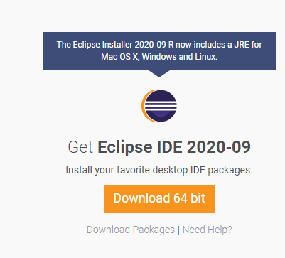

# 02. 자바와 이클립스 설치하기

## 1. 자바 설치 하기
   
[자바 JDK 설치](https://www.oracle.com/java/technologies/javase-jdk15-downloads.html)

[자바 JRE 설치](https://www.oracle.com/java/technologies/javase-jre8-downloads.html)

자바는 유료화 이후 JRE는 8.0까지만 무료 제공

## 2. 이클립스 설치 하기

[이클립스 설치](https://www.eclipse.org/downloads/)

이클립스는 지속적으로 업그레이드 됨

## 3. 다음 강의 
[03. 자바 첫 프로그램 만들고 실행하기](https://gitlab.com/easyspubjava/javacoursework/-/tree/master/Chapter1/01-03/README.md)