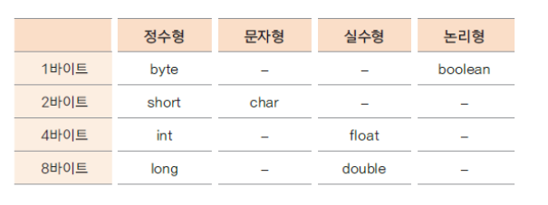
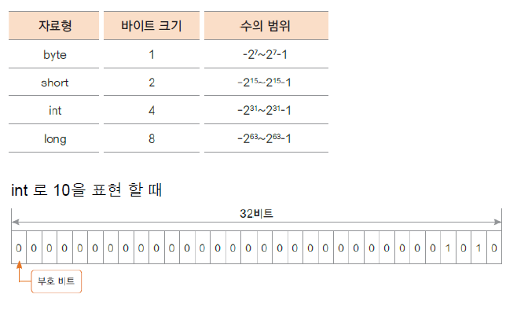

# 06. 자료형(data type) - 정수는 어떻게 표현하나요?

## 변수와 메모리
    
    변수를 선언하면 해당되는 자료형의 크기 만큼 메모리가 할당
    변수는 할당된 메모리를 가리키는 이름

    int level = 10; // 4바이트 정수형 메모리가 level 이라는 이름으로 할당 됨
    

## 기본 자료형(primitive data type)의 종류

## 정수 자료형의 종류와 크기

## byte와 short
+ byte : 1바이트 단위의 자료형 
         동영상, 음악 파일, 실행 파일의 자료를 처리할 때 사용

+ short: 2바이트 단위의 자료형 
         C/C++ 언어와 호환 시 사용

## int 

+ 자바에서 사용하는 정수에 대한 기본 자료 형

+ 4바이트 단위의 자료형

+ 프로그램에서 사용하는 모든 숫자(리터럴)은 int 로 저장됨

+ 32 비트를 초과하는 숫자는 long 자료형으로 처리

## long

+ 8바이트 자료형

+ 숫자의 뒤에 알파벳 L 또는 l 을 써서 long 형임을 표시 함

+ 예) int num = 12345678900; // 오류  
      long lnum = 12345678900; //오류  
      long lnumber = 12345678900L; // ok

## 다음 강의 
[07. 자료형(data type)- 실수는 어떻게 표현하나요?](https://gitlab.com/easyspubjava/javacoursework/-/tree/master/Chapter1/01-07/README.md)
