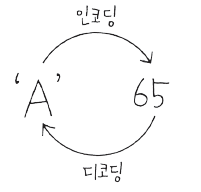

# 08. 자료형(data type) - 문자는 프로그램에서 어떻게 표현하여 사용하나요?

## - 문자도 정수로 표현합니다.
+ 어떤 문자를 컴퓨터 내부에서 표현하기 위해 특정 정수 값을 정의
+ A 는 65



+ 문자세트 : 각 문자를 얼마로 표현할 것인지 코드 값을 모아둔 것을 문자세트(charater set)라 함 <br>
            (ex. ASKII, euc-kr, utf-8, utf-16)

## - 자바에서는 문자가 어떻게 표현되나요?

+ 자바는 문자를  나타내기 위해 전세계 표준인 UNICODE를 사용

+ utf-16 인코딩을 사용 (모든 문자를 2바이트로 표시)


## - 문자형 변수 선언과 사용하기
+ 문자를 위한 데이터 타입
  **char** ch = 'A';

+ 내부적으로 숫자료 표현되므로 숫자를 넣어도 문자가 출력될 수 있음

  char ch2 = 66;

```
package ch08;

public class CharacterTest {

	public static void main(String[] args) {

		char ch1 = 'A';
		System.out.println(ch1);
		System.out.println((int)ch1);
		
		char ch2 = 66;
		System.out.println(ch2);
		
		int ch3 = 67;
		System.out.println(ch3);
		System.out.println((char)ch3);
		
		//char ch4 = -66;  음수는 대입 할 수 없음

    		char ch5 = '한';
		char ch6 = '\uD55C';
		
		System.out.println(ch5);
		System.out.println(ch6);
	}
}
```
## 참고하세요

    character set: 문자를 숫자로 변환한 값의 세트

    encoding: 문자가 숫자로 변환되는 것
    decoding: 숫자에서 다시 문자로 변환되는 것

    ASKII code: 알파벳과 숫자 특수 문자등을 1바이트에 표현하는데 사용하는 문자세트

    UNICODE: 전 세계 표준으로 만든 문자 세트

    UTF-8: 1바이트에서 4바이트까지 다양하게 문자를 표현할 수 있음

    UTF-16: 2바이트로 문자를 표현

 [한글 유니코드 표](http://www.unicode.org/charts/PDF/UAC00.pdf)

## 다음 강의
[09. 자료형(data type)- 논리형과 자료형 없이 변수 사용하기](https://gitlab.com/easyspubjava/javacoursework/-/blob/master/Chapter1/01-09/README.md)