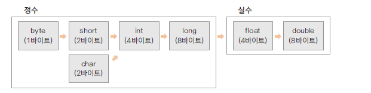

# 10. 변하지 않는 상수와 리터럴, 변수의 형 변환

## 상수(constant) 선언하기

- 상수는 변하지 않는 수

- 원주률 3.14, 1년 12개월 등

- final 예약어를 사용하여 선언

- 상수를 사용하면 변하지 않는 값을 반복하여 사용할 때 의미있는 문자로 인식하기 쉽고<br> 
  혹, 변하더라도 선언한 부분만 변경하면 되므로 여러부분을 수정할 필요가 없음

```
package ch10;

public class ConstantTest {

	public static void main(String[] args) {

		final int MAX_NUM = 100;
		final int MIN_NUM;
		
		MIN_NUM = 0;
		
		System.out.println(MAX_NUM);
		System.out.println(MIN_NUM);
		
		//MAX_NUM = 1000;
	}
}
```

## 리터럴(literal)

- 프로그램에서 사용하는 숫자, 문자, 논리값을 뜻함

- 리터럴은 상수 풀(constant pool)에 있음 

- 정수 리터럴은 int 로 실수 리터럴은 double 로 저장됨<br>
  정수의 범위가 넘어가는 경우는 L,l을 float로 사용하려는 경우는 F,f 식별자를 써줘야 함


## 형 변환 (type conversion)

- 서로 다른 자료형 간에 연산등의 수행을 위해 하나의 자료형으로 통일하는 것

- 묵시적 형 변환(explicit type conversion, 자동 형 변환)과 명시적 형 변환(implicit type conversion, 강제 형 변환)이 있음

- 바이트 크기가 작은 자료형에서 큰 자료형으로 형 변환은 자동으로 이루어 짐

- 덜 정밀한 자료형에서 더 정밀한 자료형으로읜 형 변환은 자동으로 이루어 짐



```
byte bNum = 10;
int iNum = bNum;  

int iNum1 = 20;
float fNum = iNum2;

int iNum = 10;
byte bNum = (byte)iNum;

double dNum = 3.14;
int iNum2 = (int)dNum;

```

## 연산 중 형 변환 예제

```
package ch10;

public class TypeConversion {

	public static void main(String[] args) {

		double dNum = 1.2;
		float fNum = 0.9F;
		
		int iNum1 = (int)dNum + (int)fNum;
		int iNum2 = (int)(dNum + fNum);
		
		System.out.println(iNum1);
		System.out.println(iNum2);
	}

}
```

## 다음 강의
[11.자바의 연산자들 -1 (대입, 부호, 산술, 복합대입, 증감연산자)](https://gitlab.com/easyspubjava/javacoursework/-/blob/master/Chapter1/01-11/README.md)


