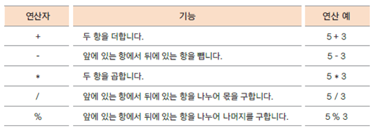
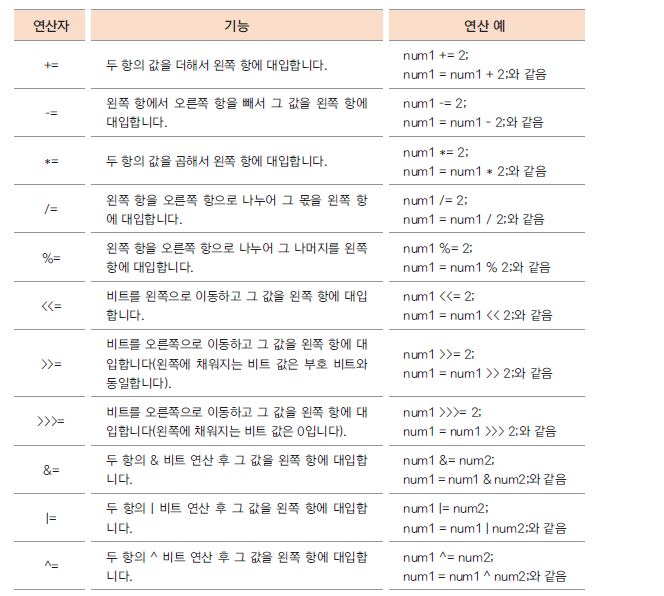
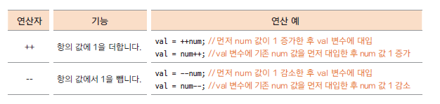

# 11. 자바의 연산자들 -1 (대입, 부호, 산술, 복합대입, 증감연산자)

## 항과 연산자

- 항(operand) : 연산에 사용되는 값

- 연산자 (operator) : 항을 이용하여 연산하는 기호

## 대입 연산자 (assignment operator)

- 변수에 다른 변수나 값을 대입하는 연산자

- 이항 연산자 중 우선 순위가 가장 낮은 연산자들

- 왼쪽 변수 = 오른쪽 변수(또는 식, 값)

## 부호 연산자

- 단항 연산자 

- 변수의 부호를 유지 하거나(+) 바꿈(-)

- 실제 변수의 부호가 변하려면 대입 연산자를 사용해야 함

## 산술 연산자

- 사칙 연산자  

- % 나머지 구하는 연산자, 숫자 n 의 나머지 범위는 0 ~ n-1

## 복합 대입 연산자

- 대입 연산자와 다른 연산자가 함께 쓰임 
  

## 증가, 감소 연산자

- 단항 연산자

- 변수의 값을 1 더하거나 1 뺄때 사용

- 연산자가 항의 앞에 있는가 뒤에 있는가에 따라 연산 시점과 결과가 달라짐

- 문장(statement)의 끝(;)을 기준으로 연산 시점을 생각해야 함

## 다음 강의 
[12 자바의 연산자들 -2 (관계, 논리 연산자)](https://gitlab.com/easyspubjava/javacoursework/-/blob/master/Chapter1/01-12/README.md)

