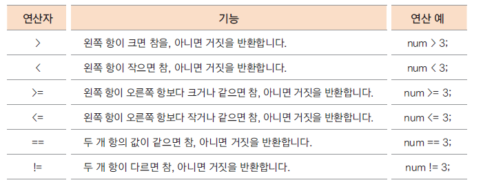
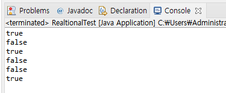
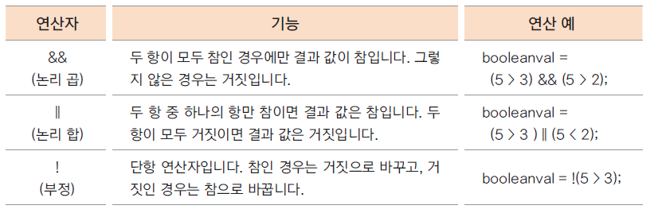
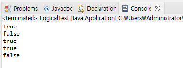
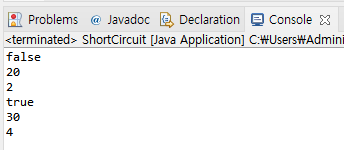

# 12. 자바의 연산자들 -2 (관계, 논리 연산자)

## 관계 연산자

- 이항 연산자

- 연산의 결과가 true(참), false(거짓)으로 반환 됨, 비교연산자 라고도 함

- 조건문, 반복문의 조건식으로 많이 사용 됨



```
package ch12;

public class RealtionalTest {

	public static void main(String[] args) {

		int num1 = 5;
		int num2 = 3;
		
		boolean value = (num1 > num2);
		System.out.println(value);
		
		System.out.println(num1 < num2);
		System.out.println(num1 >= num2);
		System.out.println(num1 <= num2);
		System.out.println(num1 == num2);
		System.out.println(num1 != num2);
	}
}
```


## 논리 연산자

- 관계 연산자와 혼합하여 많이 사용 됨

- 연산의 결과가 true(참), false(거짓)으로 반환 됨



```
package ch12;

public class LogicalTest {

	public static void main(String[] args) {
		
		int num1 = 10;
		int num2 = 20;
		
		boolean flag = (num1 > 0) && (num2 > 0);
		System.out.println(flag);
		
		flag = (num1 < 0) && (num2 > 0);
		System.out.println(flag);
		
		flag = (num1 > 0) || (num2 > 0);
		System.out.println(flag);
		
		flag = (num1 < 0) || (num2 > 0);
		System.out.println(flag);
		
		flag = !(num1 > 0);
		System.out.println(flag);
	}
}
```


## 논리 연산에서 모든 항이 실행되지 않는 경우 - 단락 회로 평가 (short circuit evaluation)

- 논리 곱(&&)은 두 항의 결과가 모두 true일 때만 결과가 true

  -- 앞의 항의 결과가 false이면 뒤 항의 결과를 평가하지 않음

- 논리 합(||)은 두 항의 결과가 모두 false일 때만 결과가 false
   
  -- 앞의 항의 결과가 true이면 뒤 항의 결과를 평가하지 않음 

```
package ch12;

public class ShortCircuit {

	public static void main(String[] args) {
		
		int num1 = 10;
		int i = 2;
		
		boolean value = ((num1 = num1 + 10 ) < 10) && ( ( i = i + 2 ) < 10);
		System.out.println(value);
		System.out.println(num1);
		System.out.println(i);
		
		value = ((num1 = num1 + 10 ) < 10) || ( ( i = i + 2 ) < 10);
		System.out.println(value);
		System.out.println(num1);
		System.out.println(i);
		
	}
}
```

## 다음 강의 
[13. 자바의 연산자들 -3 (조건 연산자, 비트 연산자)](https://gitlab.com/easyspubjava/javacoursework/-/blob/master/Chapter1/01-13/README.md)


