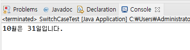
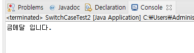
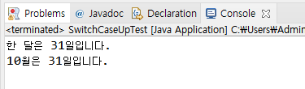

# 16. 조건이 여러 개 일 때 간단히 표현되는 switch-case 문

# switch - case 문

- if - else if - else 문을 사용할 때 복잡하고 번거로운 부분을 가독성 좋게 구현

- 비교 조건이 특정 값이나 문자열인 경우 사용

- break 문을 사용하여 각 조건이 만족되면 switch 블럭을 빠져나오도록 함

- 자바 14부터 좀 더 간결해진 표현식이 지원 됨 ( break 사용하지 않음 )


## 한 달이 며칠인지 알려주는 프로그램 구현

```
package ch16;

public class SwitchCaseTest {

	public static void main(String[] args) {

		int month = 10;
		int day;
		
		switch(month){
		
			case 1: case 3: case 5: case 7: case 8: case 10: case 12:
				day = 31;
				break;
			case 4: case 6: case 9: case 11:
				day = 30;
				break;
			case 2: 
				day = 28;
				break;
			default:
				day = 0;
				System.out.println("존재하지 않는 달 입니다.");
			
		}
		System.out.println(month + "월은 " + day + "일입니다.");
	}
}
```


## 문자열 지원되는 switch - case 문

```
package ch16;

public class SwitchCaseTest2 {

	public static void main(String[] args) {
		String medal = "Gold";
		
		switch(medal) {
		
			case "Gold":
				System.out.println("금메달 입니다.");
				break;
			case "Silver":
				System.out.println("은메달 입니다.");
				break;
			case "Bronze":
				System.out.println("동메달 입니다.");
				break;
			default:
				System.out.println("메달이 없습니다.");
				break;
		}

	}
}

```



## Java 14 부터 지원 되는 Switch Expression

- 간단하게 쉼표(,)로 조건 구분

- 식으로 표현 하여 반환 값을 받을 수 있음. 리턴 값이 없는 경우는 오류가 생김

- yield 키워드 사용

```
package ch16;

public class SwitchCaseUpTest {

	public static void main(String[] args) {
		
		int month = 3;
		
		int day = switch (month) {
	    	case 1, 3, 5, 7, 8, 10,12 -> {
	    		System.out.println("한 달은 31일입니다."); 
	    		yield 31;
	    	}
	    	case 4,6,9,11 -> {
	    		System.out.println("한 달은 30일입니다."); 
	    		yield 30;
	    	}
	    	case 2 ->{
	    		System.out.println("한 달은 28일입니다.");
	    		yield 28;
	    	}
	    	default->{
	    		System.out.println("존재하지 않는 달 입니다."); 
	    		yield 0;
	    	}
		};
		System.out.println(month + "월은 " + day + "일입니다.");
	}
}
```


## 다음 강의
[17. 반복문 - while문](https://gitlab.com/easyspubjava/javacoursework/-/blob/master/Chapter1/01-17/README.md)