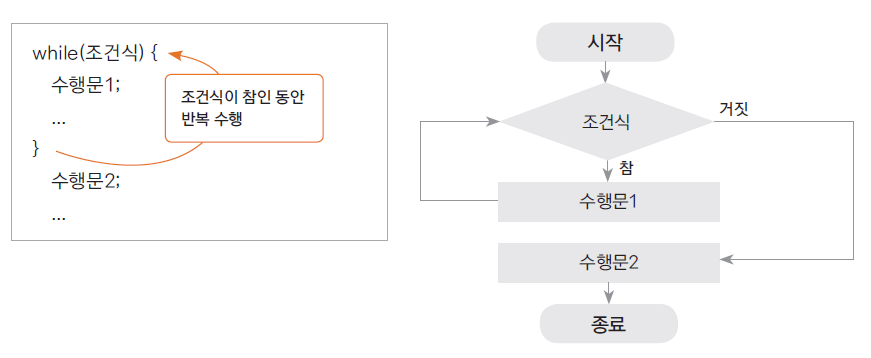

# 17. 반복문 - while문

## 조건이 참(true)인 동안 반복수행하기

- 주어진 조건에 맞는 동안(true) 지정된 수행문을 반복적으로 수행하는 제어문

- 조건이 맞지 않으면 반복하던 수행을 멈추게 됨

- 조건은 주로 반복 횟수나 값의 비교의 결과에 따라 true, false 판단 됨

- 예) 달리는 자동차, 일정 횟수 만큼 돌아가는 나사못, 특정 온도까지 가동되는 에어컨등


# while문
 
- 수행문을 수행하기 전 조건을 체크하고 그 조건의 결과가 true인 동안 반복 수행




# while 문 예제

- 1부터 10까지 더하여 그 결과를 출력해 보자

```
package ch17;

public class WhileTest {

	public static void main(String[] args) {

		int num = 1;
		int sum  = 0;
		
		while( num <= 10) {
			
			sum += num;
			num++;
		}
		
		System.out.println(sum);
		System.out.println(num);
	}

}
```

## 무한 반복 할 때

``` 
   while(true){

       .......
   }
```

## 다음 강의

[18. 반복문 - do-while문](https://gitlab.com/easyspubjava/javacoursework/-/blob/master/Chapter1/01-18/README.md)


