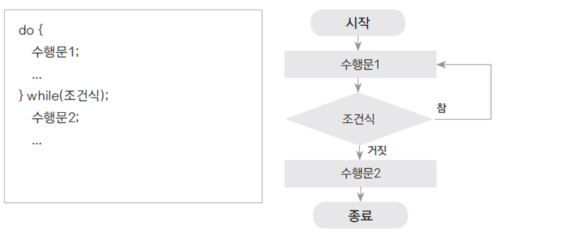

# 18. 반복문 - do-while문

## 조건과 상관 없이 한번은 수행문을 수행

- while문은 조건을 먼저 체크하고 반복 수행이 된다면, do-while은 조건과 상관 없이 수행을 한 번 하고나서 조건을 체크



- 조건이 맞지 않으면(true 가 아니면) 더 이상 수행하지 않음


## do-while 예제

- 입력받는 모든 숫자의 합을 구하는 예제 단, 입력이 0이 되면 반복을 그만하고 합을 출력

```

package ch18;

import java.util.Scanner;

public class DowhileTest {

	public static void main(String[] args) {

		Scanner scanner = new Scanner(System.in);
		int input; 
		int sum = 0;

		do {
			input = scanner.nextInt();
			sum += input;
			
		}while(input != 0);

			
		System.out.println(sum);
	}

}

```
## 다음 강의
[19. 반복문 - for문](https://gitlab.com/easyspubjava/javacoursework/-/blob/master/Chapter1/01-19/README.md)
