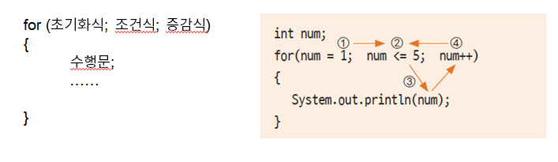
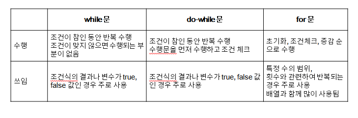
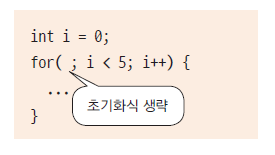
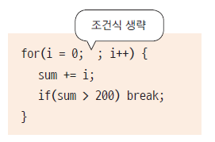
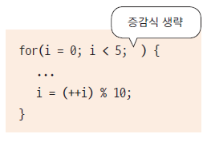
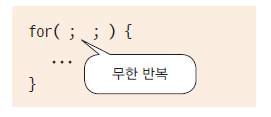

# 19. 반복문 - for 문

## for문의 수행 순서




## for문 예제 (while과 비교)

- 1부터 10까지 더한 결과를 출력하세요
```
package ch19;

public class ForTest {

	public static void main(String[] args) {
	
		int count =1;
		int sum = 0;
		
		for( int i = 0 ; i<10; i++, count++) {  //10번
			sum += count;
			//count++;
		}
		System.out.println(sum);
		
		
		int num = 1;
		int total = 0;
		
		while( num <= 10) {
			total += num;
			num++;
		}
		System.out.println(total);
	}
}

```

## 각 반복문은 주로 언제 사용하나요?




## for문의 문장들은 생략가능 합니다.

- 초기화식 생략 : 이미 이전에 값이 초기화 되어 for 내부에서 값을 지정할 필요가 없는 경우

   

- 조건식 생략 : 반복 수행에 대한 조건이 수행문 내부에 있는 경우
   
   

- 증감식 생략 : 증감식에 대한 연산이 복잡하거나 다른 변수의 연산 결과값에 결정되는 경우
   
   

- 무한 반복

   


## 참고 하세요

    i+1 과 i++은 다릅니다.
    i+1 자체는 i 값이 증가되지 않습니다. 증가하기 위해서는 대입연산자를 써야합니다.
    하지만 i++은 i = i+1, i+=1 과 동일한 의미입니다.
    따라서 값을 1씩 증가하려고 한다면 i++을 사용하세요


## 다음 강의
[20. 반복문이 여러 번 포개진 중첩 반복문](https://gitlab.com/easyspubjava/javacoursework/-/blob/master/Chapter1/01-20/README.md)