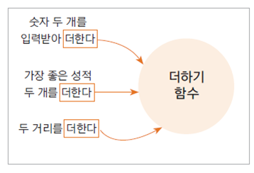
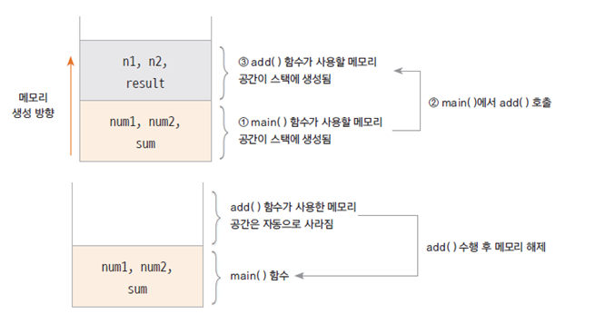

# 03. 함수와 메서드

## 함수란 (function) 

- 하나의 기능을 수행하는 일련의 코드

- 구현된(정의된) 함수는 호출하여 사용하고 호출된 함수는 기능이 끝나면 제어가 반환됨

- 함수로 구현된 하나의 기능은 여러 곳에서 동일한 방식으로 호출되어 사용될 수 있음



## 함수 정의하기

함수는 이름, 매개 변수, 반환 값, 함수 몸체(body)로 구성됨

```
int add(int num1, int num2) {
		
	int result;
	result = num1 + num2;
	return result;
}
```

## 함수 구현하기 예제

```
public class FunctionTest {
	
	public static int addNum(int num1, int num2) {
		int result;
		result = num1 + num2;
		return result;
	}
	
	public static void sayHello(String greeting) {
		System.out.println(greeting);
	}
	
	public static int calcSum() {
		
		int sum = 0;
		int i;
		
		for(i = 0; i<=100; i++) {
			sum += i;
		}
		
		return sum;
	}

	public static void main(String[] args) {
		
		int n1 = 10;
		int n2 = 20;
		
		int total = addNum(n1, n2);
		
		sayHello("안녕하세요");
		int num = calcSum();
		
		System.out.println(total);
		System.out.println(num);
	}
}
```

## 함수 호출과 스택 메모리 

- 스택 : 함수가 호출될 때 지역 변수들이 사용하는 메모리  

- 함수의 수행이 끝나면 자동으로 반환 되는 메모리





## 메서드 (method) 

- 객체의 기능을 구현하기 위해 클래스 내부에 구현되는 함수

- 멤버 함수 (member function)이라고도 함

- 메서드를 구현함으로써 객체의 기능이 구현 됨

- 메서드의 이름은 그 객체를 사용하는 객체(클라이언트)에 맞게 짓는것이 좋음

   예) getStudentName() 

  

## 다음 강의 

[04. 객체의 속성은 멤버 변수로, 객체의 기능은 메서드로 구현한다](https://gitlab.com/easyspubjava/javacoursework/-/blob/master/Chapter2/2-04/README.md)