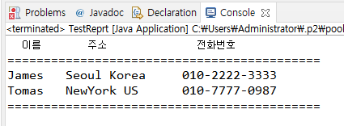

# 11. 캡슐화 (encapsulation)

## 정보 은닉을 활용한 캡슐화

- 꼭 필요한 정보와 기능만 외부에 오픈함

- 대부분의 멤버 변수와 메서드를 감추고 외부에 통합된 인터페이스만은 제공하여 일관된 기능을 구현 하게 함

- 각각의 메서드나 멤버 변수를 접근함으로써 발생하는 오류를 최소화 한다.

## 레포트 만들기 예제

```
public class MakeReport {

	StringBuffer buffer = new StringBuffer();
	
	private String line = "===========================================\n";
	private String title = "  이름\t   주소 \t\t  전화번호  \n";
	private void makeHeader()
	{
		buffer.append(line);
		buffer.append(title);
		buffer.append(line);
	}
	
	private void generateBody()
	{
		buffer.append("James \t");
		buffer.append("Seoul Korea \t");
		buffer.append("010-2222-3333\n");
		
		buffer.append("Tomas \t");
		buffer.append("NewYork US \t");
		buffer.append("010-7777-0987\n");
	}
	
	private void makeFooter()
	{
		
		buffer.append(line);
	}
	
	public String getReport()
	{
		makeHeader();
		generateBody();
		makeFooter();
		return buffer.toString();
	}
}
```

```
public class TestReprt {

	public static void main(String[] args) {

		MakeReport report = new MakeReport();
		String builder = report.getReport();
		
		System.out.println(builder);
	}

}
```


## 다음 강의
[12. 객체 자신을 가리키는 this](https://gitlab.com/easyspubjava/javacoursework/-/blob/master/Chapter2/2-12/README.md)