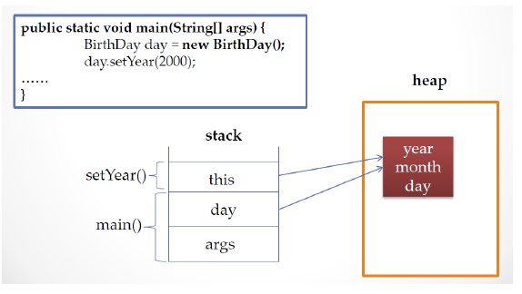

# 12. 객체 자신을 가리키는 this

## this가 하는 일

- 인스턴스 자신의 메모리를 가리킴

- 생성자에서 또 다른 생성자를 호출 할때 사용

- 자신의 주소(참조값)을 반환 함


## 생성된 인스턴스 메모리의 주소를 가짐

- 클래스 내에서 참조변수가 가지는 주소 값과 동일 한 주소 값을 가지는 키워드



``` 
public void setYear(int year)
{
    this.year = year;
}
```

## 생성자에서 다른 생성자를 호출 하는 this

- 클래스에 생성자가 여러 개 인경우, this를 이용하여 생성자에서 다른 생성자를 호출할 수 있음

- 생성자에서 다른 생성자를 호출하는 경우, 인스턴스의 생성이 완전하지 않은 상태이므로 this() statement 이전에 다른 statement를 쓸 수 없음

```
public class Person {

	String name;
	int age;
	
	public Person() {
		this("이름없음", 1);
	}
	
	public Person(String name, int age) {
		this.name = name;
		this.age = age;
	}
}
```

## 자신의 주소를 반환하는 this

```
public class Person {

	String name;
	int age;
	
	public Person() {
		this("이름없음", 1);
	}
	
	public Person(String name, int age) {
		this.name = name;
		this.age = age;
	}
	
	public Person getPerson() {
		return this;
	}
	
	
	public static void main(String[] args)
	{
		Person p = new Person();
		p.name = "James";
		p.age = 37;
		
		Person p2 = p.getPerson();
		System.out.println(p);
		System.out.println(p2);
	}
}
```


## 다음 강의
[13. 객체 간의 협력 (collabration)](https://gitlab.com/easyspubjava/javacoursework/-/blob/master/Chapter2/2-13/README.md)
