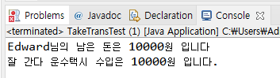

# 15. 복습해봅시다 (객체 협력)

## 다음과 같은 상황을 구현해 봅시다.

    앞의 예제에서 Edward는 지각을 해서 택시를 타야 했습니다. 
    20000원을 가지고 있었는데 10000원을 택시비로 사용했습니다.
    택시는 '잘나간다 운수' 회사 택시를 탔습니다.

출력결과  

## 다음 강의
[16. 여러 인스턴스에서 공통으로 사용하는 변수를 선언하자 - static 변수](https://gitlab.com/easyspubjava/javacoursework/-/blob/master/Chapter2/2-16/README.md)