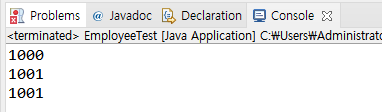
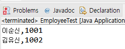

# 16. 여러 인스턴스에서 고통으로 사용하는 변수를 선언하자 - static 변수

## 공통으로 사용하는 변수가 필요한 경우 

- 여러 인스턴스가 공유하는 기준 값이 필요한 경우

- 학생마다 새로운 학번 생성

- 카드회사에서 카드를 새로 발급할때마다 새로운 카드 번호를 부여

- 회사에 사원이 입사할때 마다 새로운 사번이 필요한


## static 변수 선언과 사용하기

static int serialNum;

- 인스턴스가 생성될 때 만들어지는 변수가 아닌, 처음 프로그램이 메모리에 로딩될 때 메모리를 할당

- 클래스 변수, 정적변수라고도 함(vs. 인스턴스 변수)

- 인스턴스 생성과 상관 없이 사용 가능하므로 클래스 이름으로 직접 참조
 
 Student.serialNum = 100;


## static 변수 테스트하기

Employee.java
```
public class Employee {

	public static int serialNum = 1000;
	
	private int employeeId;
	private String employeeName;
	private String department;
		
	public int getEmployeeId() {
		return employeeId;
	}
	public void setEmployeeId(int employeeId) {
		this.employeeId = employeeId;
	}
	public String getEmployeeName() {
		return employeeName;
	}
	public void setEmployeeName(String employeeName) {
		this.employeeName = employeeName;
	}
	public String getDepartment() {
		return department;
	}
	public void setDepartment(String department) {
		this.department = department;
	}
	
}
```
EmployeeTest.java
```
public class EmployeeTest {

	public static void main(String[] args) {
		Employee employeeLee = new Employee();
		employeeLee.setEmployeeName("이순신");
		System.out.println(employeeLee.serialNum);
		
		Employee employeeKim = new Employee();
		employeeKim.setEmployeeName("김유신");
		employeeKim.serialNum++;
		
		System.out.println(employeeLee.serialNum);
		System.out.println(employeeKim.serialNum);
		
	}
}
```



- static 변수는 인스턴스에서 공통으로 사용하는 영역임음 알 수 있음


## 회사원이 입사할 때마다 새로운 사번 부여하기

Employee.java 생성자 구현
```
...

	public Employee()
	{
		serialNum++;
		employeeId = serialNum;
	}

...	

```

EmployeeTest.java
```
public class EmployeeTest {

	public static void main(String[] args) {
		Employee employeeLee = new Employee();
		employeeLee.setEmployeeName("이순신");
				
		Employee employeeKim = new Employee();
		employeeKim.setEmployeeName("김유신");
				
		System.out.println(employeeLee.getEmployeeName() + "," + employeeLee.getEmployeeId());
		System.out.println(employeeKim.getEmployeeName() + "," + employeeKim.getEmployeeId());
	}
}
```


## static 변수와 메서드는 인스턴스 변수, 메서드가 아니므로 클래스 이름으로 직접 참조

```
System.out.println(Employee.serialNum);
```

## 다음 강의
[17. static 메서드의 구현과 활용, 변수의 유효 범위](https://gitlab.com/easyspubjava/javacoursework/-/blob/master/Chapter2/2-17/README.md)