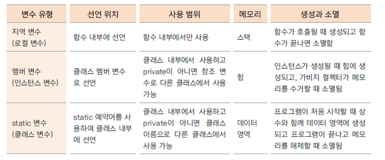

# 17. static메서드의 구현과 활용, 변수의 유효 범위

## static 메서드 만들기

- serialNum 변수를 private으로 선언하고 getter/setter 구현

Employee.java
```
private static int serialNum = 1000;

 ...
public static int getSerialNum() {
	return serialNum;
}

public static void setSerialNum(int serialNum) {
	Employee.serialNum = serialNum;
}
```

- 클래스 이름으로 호출 가능 ( 클래스 메서드, 정적 메서드 )
```
System.out.println(Employee.getSerialNum());
```

## static 메서드(클래스 메서드)에서는 인스턴스 변수를 사용할 수 없다

- static 메서드는 인스턴스 생성과 무관하게 클래스 이름으로 호출 될 수 있음

- 인스턴스 생성 전에 호출 될 수 있으므로 static 메서드 내부에서는 인스턴스 변수를 사용할 수 없음

Employee.java
```
public static void setSerialNum(int serialNum) {
		int i = 0;
		
		employeeName = "Lee";  //오류발생
		Employee.serialNum = serialNum;
	}
```

EmployeeTest2.java
```
public class EmployeeTest2 {

	public static void main(String[] args) {

		System.out.println(Employee.getSerialNum());
		Employee.setSerialNum(1003);
		System.out.println(Employee.getSerialNum());
	}
}
```

## 변수의 유효 범위와 메모리

- 변수의 유효 범위(scope)와 생성과 소멸(life cycle)은 각 변수의 종류마다 다름

- 지역변수, 멤버 변수, 클래스 변수는 유효범위와 life cycle, 사용하는 메모리도 다름 



- static 변수는 프로그램이 메모리에 있는 동안 계속 그 영역을 차지하므로 너무 큰 메모리를 할당하는 것은 좋지 않음

- 클래스 내부의 여러 메서드에서 사용하는 변수는 멤버 변수로 선언하는 것이 좋음

- 멤버 변수가 너무 많으면 인스턴스 생성 시 쓸데없는 메모리가 할당됨

- 상황에 적절하게 변수를 사용해야 함

## 다음 강의
[18. static 응용 - 싱글톤 패턴 (singleton pattern)](https://gitlab.com/easyspubjava/javacoursework/-/blob/master/Chapter2/2-18/README.md)
