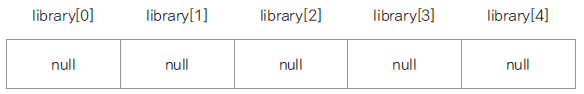
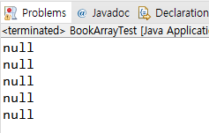
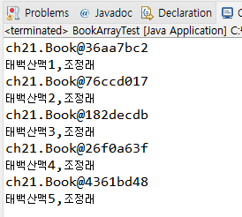
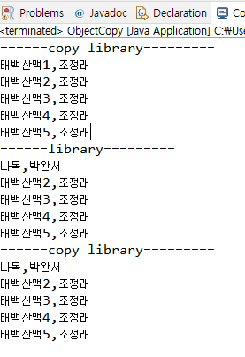
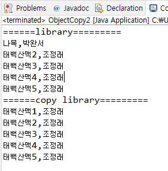

# 21. 객체 배열 사용하기


## 객체 배열 선언과 구현

- 기본 자료형 배열은 선언과 동시에 배열의 크기만큼의 메모리가 할당되지만, 
  객체 배열의 경우엔 요소가 되는 객체의 주소가 들어갈(4바이트, 8바이트) 메모리만 할당되고(null) 각 요소 객체는 생성하여 저장해야 함



Book.java
```
public class Book {

	private String title;
	private String author;
	
	public Book() {}
	
	public Book(String title, String author) {
		this.title = title;
		this.author = author;
	}

	public String getTitle() {
		return title;
	}

	public void setTitle(String title) {
		this.title = title;
	}

	public String getAuthor() {
		return author;
	}

	public void setAuthor(String author) {
		this.author = author;
	}
	
	public void showBookInfo() {
		System.out.println(title + "," +author);
	}
}
```

BookArrayTest.java
```
public class BookArrayTest {

	public static void main(String[] args) {

		Book[] library = new Book[5];
				
		for(int i =0; i<library.length; i++) {
			System.out.println(library[i]);
		}
	}
}
```


- 객체를 생성하여 각 배열의 요소로 저장하기

```
public class BookArrayTest {

	public static void main(String[] args) {

		Book[] library = new Book[5];
		
		library[0] = new Book("태백산맥1", "조정래");
		library[1] = new Book("태백산맥2", "조정래");
		library[2] = new Book("태백산맥3", "조정래");
		library[3] = new Book("태백산맥4", "조정래");
		library[4] = new Book("태백산맥5", "조정래");
		
		for(int i =0; i<library.length; i++) {
			System.out.println(library[i]);
			library[i].showBookInfo();
		}
	}
}
```


## 객체 배열 복사하기

- System.arrayCopy(src, srcPos, dest, destPos, length) 자바에서 제공되는 배열 복사 메서드

- 얕은 복사

   객체 주소만 복사되어 한쪽 배열의 요소를 수정하면 같이 수정 됨
   
   즉, 두 배열이 같은 객체를 가리킴

```
public class ObjectCopy {

	public static void main(String[] args) {

		Book[] library = new Book[5];
		Book[] copyLibaray = new Book[5];
		
		library[0] = new Book("태백산맥1", "조정래");
		library[1] = new Book("태백산맥2", "조정래");
		library[2] = new Book("태백산맥3", "조정래");
		library[3] = new Book("태백산맥4", "조정래");
		library[4] = new Book("태백산맥5", "조정래");
		
		System.arraycopy(library, 0, copyLibaray, 0, 5);
		
		System.out.println("======copy library=========");
		for( Book book : copyLibaray ) {
			book.showBookInfo();
		}
		
		library[0].setTitle("나목");
		library[0].setAuthor("박완서");
		
		System.out.println("======library=========");
		for( Book book : library) {
			book.showBookInfo();
		}
		
		System.out.println("======copy library=========");
		
		for( Book book : copyLibaray) {
			book.showBookInfo();
		}
	}
}
```


- 깊은 복사 
 
  각각의 객체를 생성하여 그 객체의 값을 복사하여 배열이 서로 다른 객체를 가리키도록 함

```
public class ObjectCopy2 {

	public static void main(String[] args) {

		Book[] library = new Book[5];
		Book[] copyLibaray = new Book[5];
		
		library[0] = new Book("태백산맥1", "조정래");
		library[1] = new Book("태백산맥2", "조정래");
		library[2] = new Book("태백산맥3", "조정래");
		library[3] = new Book("태백산맥4", "조정래");
		library[4] = new Book("태백산맥5", "조정래");
		
		copyLibaray[0] = new Book();
		copyLibaray[1] = new Book();
		copyLibaray[2] = new Book();
		copyLibaray[3] = new Book();
		copyLibaray[4] = new Book();
		
		for(int i = 0; i< library.length; i++) {
			copyLibaray[i].setTitle(library[i].getTitle());
			copyLibaray[i].setAuthor(library[i].getAuthor());
		}
		
		
		library[0].setTitle("나목");
		library[0].setAuthor("박완서");
	
		System.out.println("======library=========");
		for( Book book : library) {
			book.showBookInfo();
		}
		
		System.out.println("======copy library=========");
		for( Book book : copyLibaray) {
			book.showBookInfo();
		}
	}
}
```


## 다음 강의
[22. 2차원 배열 사용하기](https://gitlab.com/easyspubjava/javacoursework/-/blob/master/Chapter2/2-22/README.md)
