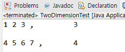

# 22. 2차원 배열 사용하기

## 다차원 배열

- 이차원 이상으로 구현 된 배열

- 평면 (이차원 배열) 이나 공간(삼차원 배열)을 활용한 프로그램 구현

## 이차원 배열 예제


```
int[][] arr = {{1,2,3}, {4,5,6}}
```

```
public class TwoDimensionTest {

	public static void main(String[] args) {
		int[][] arr = { {1,2,3}, {4,5,6,7}};
		int i, j;
		
		for(i =0; i<arr.length; i++) {
			for(j=0; j<arr[i].length; j++) {
				System.out.print(arr[i][j] + " ");
			}
			System.out.println(", \t" + arr[i].length);
			System.out.println();
		}
	}
}
```


## 다음 강의 
[23. 객체 배열을 구현한 클래스 ArrayList](https://gitlab.com/easyspubjava/javacoursework/-/blob/master/Chapter2/2-23/README.md)


