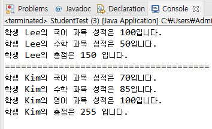

# 24. ArrayList를 활용한 간단한 성적 산출 프로그램

## 예제 시나리오 

    1001학번 Lee와 1002학번 Kim, 두 학생이 있습니다. 
    Lee 학생은 국어와 수학 2과목을 수강했고, Kim 학생은 국어, 수학, 영어 3 과목을 수강하였습니다.
    Lee 학생은 국어 100점, 수학 50점입니다. 
    Kim 학생은 국어 70점, 수학 85점, 영어 100점입니다. 
    Student와 Subject 클래스를 만들고 ArrayList를 활용하여 두 학생의 과목 성적과 총점을 출력하세요

## Student 클래스
```
import java.util.ArrayList;

public class Student {
	
	int studentID;
	String studentName;
	ArrayList<Subject> subjectList;
		
	public Student(int studentID, String studentName){
		this.studentID = studentID;
		this.studentName = studentName;
		
		subjectList = new ArrayList<Subject>();
	}
	
	public void addSubject(String name, int score){
		Subject subject = new Subject();
		
		subject.setName(name);
		subject.setScorePoint(score);
		subjectList.add(subject);
	}
	
	public void showStudentInfo()
	{
		int total = 0;
		
		for(Subject s : subjectList){
			
			total += s.getScorePoint();
			System.out.println("학생 " + studentName + "의 " + s.getName() + " 과목 성적은 " + 
			        s.getScorePoint() + "입니다.");
		}
			
		System.out.println("학생 " + studentName + "의 총점은 " + total + " 입니다.");
	}
}
```

## Subject 클래스
```
public class Subject {
	
	private String name;
	private int scorePoint;
	
	public String getName() {
		return name;
	}
	public void setName(String name) {
		this.name = name;
	}
	public int getScorePoint() {
		return scorePoint;
	}
	public void setScorePoint(int scorePoint) {
		this.scorePoint = scorePoint;
	}
}
```

## 실행하기
```
public class StudentTest {

	public static void main(String[] args) {
		Student studentLee = new Student(1001, "Lee");
		
		studentLee.addSubject("국어", 100);
		studentLee.addSubject("수학", 50);
		
		Student studentKim = new Student(1002, "Kim");
		
		studentKim.addSubject("국어", 70);
		studentKim.addSubject("수학", 85);
		studentKim.addSubject("영어", 100);
		
		studentLee.showStudentInfo();
		System.out.println("======================================");
		studentKim.showStudentInfo();
	}
}
```


