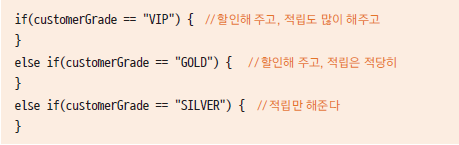
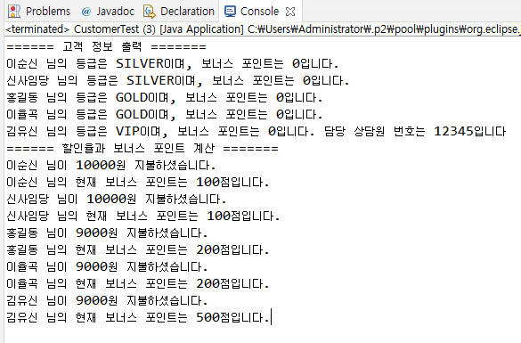

# 06. 다형성과 다형성을 사용하는 이유

## 다형성(polymorphism) 이란?

- 하나의 코드가 여러 자료형으로 구현되어 실행되는 것

- 같은 코드에서 여러 다른 실행 결과가 나옴

- 정보은닉, 상속과 더불어 객체지향 프로그래밍의 가장 큰 특징 중 하나임

- 다형성을 잘 활용하면 유연하고 확장성있고, 유지보수가 편리한 프로그램을 만들수 있음

## 다형성의 예

```
class Animal{
	
	public void move() {
		System.out.println("동물이 움직입니다.");
	}
	
	public void eating() {
		
	}
}

class Human extends Animal{
	public void move() {
		System.out.println("사람이 두발로 걷습니다.");
	}
	
	public void readBooks() {
		System.out.println("사람이 책을 읽습니다.");
	}
}

class Tiger extends Animal{
	
	public void move() {
		System.out.println("호랑이가 네 발로 뜁니다.");
	}
	
	public void hunting() {
		System.out.println("호랑이가 사냥을 합니다.");
	}
}


class Eagle extends Animal{
	public void move() {
		System.out.println("독수리가 하늘을 날아갑니다.");
	}
	
	public void flying() {
		System.out.println("독수리가 날개를 쭉 펴고 멀리 날아갑니다");
	}
}


public class AnimalTest {

	public static void main(String[] args) {

		Animal hAnimal = new Human();
		Animal tAnimal = new Tiger();
		Animal eAnimal = new Eagle();
		
		AnimalTest test = new AnimalTest();
		test.moveAnimal(hAnimal);
		test.moveAnimal(tAnimal);
		test.moveAnimal(eAnimal);
		
		ArrayList<Animal> animalList = new ArrayList<Animal>();
		animalList.add(hAnimal);
		animalList.add(tAnimal);
		animalList.add(eAnimal);
		
		for(Animal animal : animalList) {
			animal.move();
		}
	}	
	
	public void moveAnimal(Animal animal) {
		animal.move();
		
	}
}
```

## 다형성을 사용하는 이유?

- 다른 동물을 추가하는 경우

- 상속과 메서드 재정의를 활용하여 확장성 있는 프로그램을 만들 수 있음

- 그렇지 않는 경우 많은 if-else if문이 구현되고 코드의 유지보수가 어려워짐



- 상위 클래스에서는 공통적인 부분을 제공하고 하위 클래스에서는 각 클래스에 맞는 기능 구현

- 여러 클래스를 하나의 타입(상위 클래스)으로 핸들링 할 수 있음


## 다형성을 활용한 멤버십 프로그램 확장

- 일반 고객과 VIP 고객 중간 멤버십 만들기

	고객이 늘어 일반 고객보다는 많이 구매하고 VIP보다는 적게 구매하는 고객에게도 해택을 주기로 했다.
	
	GOLD 고객 등급을 만들고 혜택은 다음과 같다

	1. 제품을 살때는 10프로를 할인해준다
	2. 보너스 포인트는 2%를 적립해준다

GoldCustomer.java
```
public class GoldCustomer extends Customer{

	double saleRatio;
	
	public GoldCustomer(int customerID, String customerName){
		super(customerID, customerName);
	
		customerGrade = "GOLD";
		bonusRatio = 0.02;
		saleRatio = 0.1;
	
	}
	
	public int calcPrice(int price){
		bonusPoint += price * bonusRatio;
		return price - (int)(price * saleRatio);
	}
}
```

VIPCustomer.java
```
//showCustomerInfo() 재정의
public String showCustomerInfo(){
		return super.showCustomerInfo() + " 담당 상담원 번호는 " + agentID + "입니다";  
}
```

CustomerTest.java
```
public class CustomerTest {

	public static void main(String[] args) {
		
		ArrayList<Customer> customerList = new ArrayList<Customer>();
		
		Customer customerLee = new Customer(10010, "이순신");
		Customer customerShin = new Customer(10020, "신사임당");
		Customer customerHong = new GoldCustomer(10030, "홍길동");
		Customer customerYul = new GoldCustomer(10040, "이율곡");
		Customer customerKim = new VIPCustomer(10050, "김유신", 12345);
		
		customerList.add(customerLee);
		customerList.add(customerShin);
		customerList.add(customerHong);
		customerList.add(customerYul);
		customerList.add(customerKim);
		
		System.out.println("====== 고객 정보 출력 =======");
		
		for( Customer customer : customerList){
			System.out.println(customer.showCustomerInfo());
		}
		
		System.out.println("====== 할인율과 보너스 포인트 계산 =======");
		
		int price = 10000;
		for( Customer customer : customerList){
			int cost = customer.calcPrice(price);
			System.out.println(customer.getCustomerName() +" 님이 " +  + cost + "원 지불하셨습니다.");
			System.out.println(customer.getCustomerName() +" 님의 현재 보너스 포인트는 " + customer.bonusPoint + "점입니다.");
		}
	}
}
```


## 다음 강의
[07. 상속은 언제 사용 할까?](https://gitlab.com/easyspubjava/javacoursework/-/blob/master/Chapter3/3-07/README.md)
