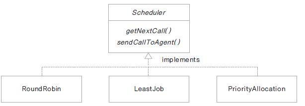
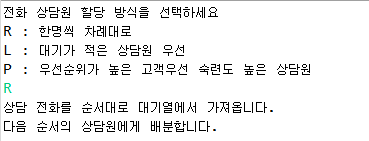

# 16. 복습해보세요

## 추상 클래스와 템플릿 메서드

Player가 있고 Player는 GameLevel 속성을 가집니다. 각 GameLevel 단계 마다 run(), jump(), turn() 세 가지 기능이 업그레이드 됩니다. 

초보자 레벨 : 천천히 달립니다. run() 만 가능

중급자 레벨 : 빠르게 달리고, 점프할 수 있습니다. run(), jump() 가능

고급자 레벨 : 엄청 빠르게 달리고, 높게 점프하고, 턴할 수 있습니다. run(), jump(), turn() 가능

Player는 한번에 하나의 레벨 상태만을 가질 수 있습니다.

Player가 play() 중에 레벨에 있는 go(int count) 라는 메서드를 호출하면 run() 하고 count 횟수 만큼 jump() 하고 turn() 합니다. 다음 클래스 다이어그램을 참고하여 각 레벨에서 go() 가 호출 될때 다음과 같이 출력 되도록 하세요


## 인터페이스를 활용한 정책 프로그래밍

고객 센터에 전화 상담을 하는 상담원들이 있습니다. 일단 고객에게서 전화가 오면 대기열에 저장되고 각 상담원에게 배분이 됩니다. 

배분이 되는 정책은 크게 세 가지가 있습니다.

1. 모든 상담원이 동일한 상담 건수를 처리하도록 상담원 순서대로 배분합니다.

2. 쉬고 있거나 상담원에게 할당된 통화 수가 가장 적은 상담원에게 배분합니다.

3. 고객의 등급에 따라 등급이 높은 고객은 업무능력이 우수한 상담원에게 배분합니다. 

세 가지 정책은 필요에 따라 바뀌어 운영될 수 있습니다. 다음 클래스 다이어그램을 참고하여 각 배분 규칙이 적용되도록 구현해 보세요




테스트 프로그램은 다음과 같습니다. 문자를 입력 받아 입력되는 문자에 따라 배분 규칙을 수행하도록 합니다.

```
public class SchedulerTest {

	public static void main(String[] args) throws IOException {

		System.out.println("전화 상담원 할당 방식을 선택하세요");
		System.out.println("R : 한명씩 차례대로");
		System.out.println("L : 대기가 적은 상담원 우선");
		System.out.println("P : 우선순위가 높은 고객우선 숙련도 높은 상담원");
		
		int ch = System.in.read();
		Scheduler scheduler = null;
		
		if ( ch == 'R' || ch =='r') {
			scheduler = new RoundRobin();
		}
		else if ( ch == 'L' || ch =='l') {
			scheduler = new LeastJob();
		}
		else if ( ch == 'P' || ch =='p') {
			scheduler = new PriorityAllocation();
		}
		else {
			System.out.println("지원되지 않는 기능입니다.");
			return;
		}
		
		scheduler.getNextCall();
		scheduler.sendCallToAgent();
	}

}
```
