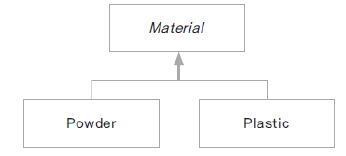

# 07. <T extends 클래스> 사용하기

## 상위 클래스의 필요성

- T 자료형의 범위를 제한 할 수 있음

- 상위 클래스에서 선언하거나 정의하는 메서드를 활용할 수 있음

- 상속을 받지 않는 경우 T는 Object로 변환되어 Object 클래스가 기본으로 제공하는 메서드만 사용가능

## T extends 를 사용한 프로그래밍

- GenericPrinter<T> 에 material 변수의 자료형을 상속받아 구현

- T에 무작위 클래스가 들어갈 수 없게 Material 클래스를 상속받은 클래스로 한정



Material.java
```
public abstract class Material {
	
	public abstract void doPrinting();
}
```

Powder.java
```
public class Powder extends Material{
		
	public void doPrinting() {
		System.out.println("Powder 재료로 출력합니다");
	}
	
	public String toString() {
		return "재료는 Powder 입니다";
	}
}
```

Plastic.java
```
public class Plastic extends Material{

	public void doPrinting() {
		System.out.println("Plastic 재료로 출력합니다");
	}
	
	public String toString() {
		return "재료는 Plastic 입니다";
	}
}
```

GenericPrinter.java
```
public class GenericPrinter<T extends Material> {
	private T material;
	
	public void setMaterial(T material) {
		this.material = material;
	}
	
	public T getMaterial() {
		return material;
	}
	
	public String toString(){
		return material.toString();
	}
	
	public void printing() {
		material.doPrinting();
	}
}
```

GenericPrinterTest.java
```
public class GenericPrinterTest {

	public static void main(String[] args) {

		GenericPrinter<Powder> powderPrinter = new GenericPrinter<Powder>();
		powderPrinter.setMaterial(new Powder());
		Powder powder = powderPrinter.getMaterial(); // 형변환 하지 않음
		System.out.println(powderPrinter);
		
		GenericPrinter<Plastic> plasticPrinter = new GenericPrinter<Plastic>();
		plasticPrinter.setMaterial(new Plastic());
		Plastic plastic = plasticPrinter.getMaterial(); // 형변환 하지 않음
		System.out.println(plasticPrinter);
		
	/*	GenericPrinter powderPrinter2 = new GenericPrinter();
		powderPrinter2.setMaterial(new Powder());
		Powder powder = (Powder)powderPrinter.getMaterial();
		System.out.println(powderPrinter);
		*/
		//GenericPrinter<Water> printer = new GenericPrinter<Water>();	
	}
}
```


