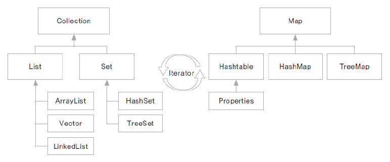

# 09. 자바에서 제공되는 자료구조 구현 클래스들 - 컬레션 프레임워크

## 컬렉션 프레임워크

- 프로그램 구현에 필요한 자료구조(Data Structure)를 구현해 놓은 JDK 라이브러리

- java.util 패키지에 구현되어 있음

- 개발에 소요되는 시간을 절약하면서 최적화 된 알고리즘을 사용할 수 있음

- 여러 구현 클래스와 인터페이스의 활용에 대한 이해가 필요함

## Collection 인터페이스

- 하나의 객체를 관리하기 위한 메서드가 선언된 인터페이스의

- 하위에 List와 Set 인터페이스가 있음

## List 인터페이스

- 객체를 순서에 따라 저장하고 관리하는데 필요한 메서드가 선언된 인터페이스

- 자료구조 리스트 (배열, 연결리스트)의 구현을 위한 인터페이스

- 중복을 허용함 

- ArrayList, Vector, LinkedList, Stack, Queue 등...

## Set 인터페이스

- 순서와 관계없이 중복을 허용하지 않고 유일한 값을 관리하는데 필요한 메서드가 선언됨 

- 아이디, 주민번호, 사번등을 관리하는데 유용

- 저장된 순서와 출력되는 순서는 다를 수 있음

- HashSet, TreeSet등...

## Map 인터페이스

- 쌍(pair)로 이루어진 객체를 관리하는데 사용하는 메서드들이 선언된 인터페이스

- 객체는 key-value의 쌍으로 이루어짐

- key는 중복을 허용하지 않음

- HashTable, HashMap, Properties, TreeMap 등이 Map 인터페이스를 구현 함
