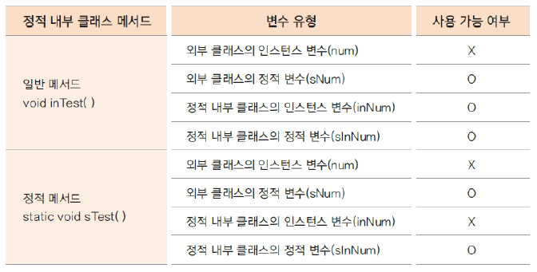
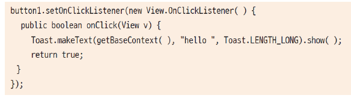

# 01. 여러 내부 클래스의 정의와 유형

## 내부 클래스란? (inner class)

- 클래스 내부에 선언한 클래스로 이 클래스를 감싸고 있는 외부 클래스와 밀접한 연관이 있는 경우가 많고, 

다른 외부 클래스에서 사용할 일이 거의 없는 경우에 내부 클래스로 선언해서 사용함

- 중첩 클래스라고도 함

- 내부 클래스의 종류

 인스턴스 내부 클래스, 정적(static) 내부 클래스, 지역(local) 내부 클래스, 익명(anonymous) 내부 클래스


## 인스턴스 내부 클래스

- 내부적으로 사용할 클래스를 선언 (private으로 선언하는 것을 권장)

- 외부 클래스가 생성된 후 생성됨 ( 정적 내부 클래스와 다름 )

- private이 아닌 내부 클래스는 다른 외부 클래스에서 생성할 수 있음

```
OutClass outClass = new OutClass();
OutClass.InClass inClass = outClass.new InClass();
```

- 인스턴스 내부 클래스 예

```
class OutClass {

	private int num = 10;
	private static int sNum = 20;
	private InClass inClass;
	
	public OutClass(){
		inClass = new InClass(); // 내부 클래스 생성
	}
	
	class InClass{
		
		int inNum = 100;
		//static int sInNum = 200;  //에러 남
		
		void inTest(){
			System.out.println("OutClass num = " +num + "(외부 클래스의 인스턴스 변수)");
			System.out.println("OutClass sNum = " + sNum + "(외부 클래스의 스태틱 변수)");
			System.out.println("InClass inNum = " + inNum + "(내부 클래스의 인스턴스 변수)");
		}
		
	    //static void sTest(){  //에러 남
	    	
	    //}
		
	}
	
	public void usingClass(){
		inClass.inTest(); //내부 클래스 변수를 사용하여 메서드 호출하기
	}
}

public class InnerTest {

	public static void main(String[] args) {
		OutClass outClass = new OutClass();
		System.out.println("외부 클래스 이용하여 내부 클래스 기능 호출");
		outClass.usingClass();    // 내부 클래스 기능 호출
	    System.out.println();
	    
		OutClass.InClass inClass = outClass.new InClass();   // 외부 클래스를 이용하여 내부 클래스 생성
		System.out.println("외부 클래스 변수를 이용하여 내부 클래스 생성");
		inClass.inTest();
	}

}
```

## 정적 내부 클래스

- 외부 클래스 생성과 무관하게 사용할 수 있음

- 정적 변수, 정적 메서드 사용

- 정정 내부 클래스 예

```
class OutClass {

	private int num = 10;
	private static int sNum = 20;
	private InClass inClass;
	
	public OutClass(){
		inClass = new InClass(); // 내부 클래스 생성
	}
	
	class InClass{
		
		int inNum = 100;
		//static int sInNum = 200;  //에러 남
		
		void inTest(){
			System.out.println("OutClass num = " +num + "(외부 클래스의 인스턴스 변수)");
			System.out.println("OutClass sNum = " + sNum + "(외부 클래스의 스태틱 변수)");
			System.out.println("InClass inNum = " + inNum + "(내부 클래스의 인스턴스 변수)");
		}
		
	    //static void sTest(){  //에러 남
	    	
	    //}
		
	}
	
	public void usingClass(){
		inClass.inTest(); //내부 클래스 변수를 사용하여 메서드 호출하기
	}
	
	static class InStaticClass{
		
		int inNum = 100;
		static int sInNum = 200;
		
		void inTest(){   //정적 클래스의 일반 메서드
			//num += 10;    // 외부 클래스의 인스턴스 변수는 사용할 수 없음.
			System.out.println("InStaticClass inNum = " + inNum + "(내부 클래스의 인스턴스 변수 사용)"); 
			System.out.println("InStaticClass sInNum = " + sInNum + "(내부 클래스의 스태틱 변수 사용)");
			System.out.println("OutClass sNum = " + sNum + "(외부 클래스의 스태틱 변수 사용)");
		}
		
		static void sTest(){  // 정적 클래스의 static 메서드
			//num += 10;   // 외부 클래스의 인스턴스 변수는 사용할 수 없음.
			//inNum += 10; // 내부 클래스의 인스턴스 변수는 사용할 수 없음
			
			System.out.println("OutClass sNum = " + sNum + "(외부 클래스의 스태틱 변수 사용)");
			System.out.println("InStaticClass sInNum = " + sInNum + "(내부 클래스의 스태틱 변수 사용)");
			
		}
	}	
}

public class InnerTest {

	public static void main(String[] args) {

	   .....
	   	
		//외부 클래스 생성하지 않고 바로 정적 내부 클래스 생성
		OutClass.InStaticClass sInClass = new OutClass.InStaticClass();  
		System.out.println("정적 내부 클래스 일반 메서드 호출");
		sInClass.inTest();
		System.out.println();
		
		System.out.println("정적 내부 클래스의 스태틱 메소드 호출");
		OutClass.InStaticClass.sTest();
	}

}
```
- 정적 내부 클래스 일반 메서드와 정적 메서드에서의 변수 사용 



## 지역 내부 클래스

- 지역 변수와 같이 메서드 내부에서 정의하여 사용하는 클래스

- 메서드의 호출이 끝나면 메서드에 사용된 지역변수의 유효성은 사라짐

- 메서드 호출 이후에도 사용해야 하는 경우가 있을 수 있으므로 지역 내부 클래스에서 사용하는 메서드의 지역 변수나 매개 변수는 

final로 선언됨

```
class Outer{
	
	int outNum = 100;
	static int sNum = 200;
	
		
	Runnable getRunnable(int i){

		int num = 100;
		
		class MyRunnable implements Runnable{

			int localNum = 10;
				
			@Override
			public void run() {
				//num = 200;   //에러 남. 지역변수는 상수로 바뀜
				//i = 100;     //에러 남. 매개 변수 역시 지역변수처럼 상수로 바뀜
				System.out.println("i =" + i); 
				System.out.println("num = " +num);  
				System.out.println("localNum = " +localNum);
					
				System.out.println("outNum = " + outNum + "(외부 클래스 인스턴스 변수)");
				System.out.println("Outter.sNum = " + Outer.sNum + "(외부 클래스 정적 변수)");
				}
			}
		 return new MyRunnable();
	}
}

public class LocalInnerTest {

	public static void main(String[] args) {

		Outer out = new Outer();
		Runnable runner = out.getRunnable(10);
		runner.run();
	}
}
```
- MyRunnable 클래스를 사용하려면 직접 생성하는 것이 아닌 getRunnable()메서드를 호출하여 생성된 개체를 반환 받아야 함

## 익명 내부 클래스

- 이름이 없는 클래스 (위 지역 내부 클래스의 MyRunnable 클래스 이름은 실제로 호출되는 경우가 없음)

- 클래스의 이름을 생략하고 주로 하나의 인터페이스나 하나의 추상 클래스를 구현하여 반환

- 인터페이스나 추상 클래스 자료형의 변수에 직접 대입하여 클래스를 생성하거나 지역 내부 클래스의 메서드 내부에서 생성하여 반환 할 수 있음.

- widget의 이벤트 핸들러에 활용됨



- 익명 내부 클래스 예

```
class Outter2{
		
	Runnable getRunnable(int i){

		int num = 100;
		
		return new Runnable() {
				
		@Override
		public void run() {
			//num = 200;   //에러 남
			//i = 10;      //에러 남
			System.out.println(i);
			System.out.println(num);
			}
		};
	}
	
	Runnable runner = new Runnable() {
		
		@Override
		public void run() {
			System.out.println("Runnable 이 구현된 익명 클래스 변수");
			
		}
	};
}

public class AnonymousInnerTest {

	public static void main(String[] args) {
		Outter2 out = new Outter2();
	
		Runnable runnerble = out.getRunnable(10);
		runnerble.run();
		
		out.runner.run();
	}
}
```


