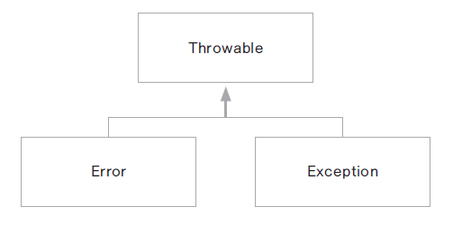
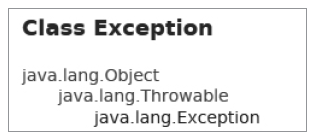
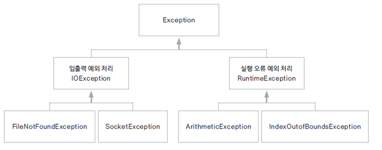

# 08.예외 처리는 왜 해야 하나? 자바에서 제공되는 클래스들

## 프로그램에서의 오류

- 컴파일 오류(compile error) 

  프로그램 코드 작성 중 발생하는 문법적 오류

  최근에는 개발 환경(eclipse)에서 대부분의 컴파일 오류는 detection 됨

- 실행 오류(runtime error) 

  실행 중인 프로그램이 의도 하지 않은 동작(bug)을 하거나 프로그램이 중지 되는 오류

  실행 오류는 비정상 종료가 되는 경우 시스템의 심각한 장애를 발생할 수 있음

## 예외 처리의 중요성

- 프로그램의 비정상 종료를 피하여 시스템이 원할이 실행되도록 함

- 실행 오류가 발생한 경우 오류의 과정을 재현하는 것은 현실적으로 힘들다

- 오류가 발생한 경우 log를 남겨서 추후 log 분석을 통해 그 원인을 파악하여 bug를 수정하는 것이 중요

## 오류와 예외 클래스

- 시스템 오류(error) : 가상 머신에서 발생, 프로그래머가 처리 할 수 없는 오류임

   동적 메모리가 없는 경우, 스택 메모리 오버플로우등

- 예외(Exception) :프로그램에서 제어 할 수 있는 오류
  
  읽어들이려는 파일이 존재하지 않거나, 네트웍이나 DB연결이 안되는 경우등

- 자바는 안전성이 중요한 언어로 대부분 프로그램에서 발생하는 오류에 대해 문법적으로 예외 처리를 해야함

  

## 예외 클래스들

- 모든 예외 클래스의 최상위 클래스는 Exception 클래스



- 자바에서는 다양한 예외들에 대해 그 처리를 위한 클래스가 제공되고 있음



- Arithmetic Exception :정수를 0 으로 나눈 경우 발생

- NullPointerException : 초기화 되지 않은 Object를 사용하는 경우
```
Dog d = null;
System.out.println(dog);
```

- ArrayIndexOutOfBoundsException :배열의 크기를 넘어선 위치를 참조하려는 경우

- FileNotFoundException :참조하는 파일이 지정된 위치에 존재하지 않는 경우

- ClassNotFoundException :

```
Class.forName(“sis.studentinfo.Student”); //클래스가 로드되지 않은 경우
```

- InterruptedException :Thread.sleep(), join(). Object의 wait()로 non-runnable 상태인 thread를 Runnable하게 만들 수 있도록 사용할 수 있음


