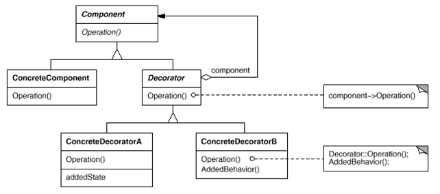

# 19. 데코레이터 패턴을 활용한 커피 머신 프로그램

## Decorator Pattern

- 자바의 입출력 스트림은 decorator pattern 임

- 여러 decorator들을 활용하여 다양한 기능을 제공

- 상속 보다 유연한 구현 방식

- 데코레이터는 다른 데코레이터나 또는 컴포넌트를 포함해야 함

- 지속적인 기능의 추가와 제거가 용이함

- decorator와 component는 동일한 것이 아님 ( 기반 스트림 클래스가 직접 읽고 쓸수 있음, 보조 스트림은 추가적인 기능 제공)



## 커피를 만들어보아요~

    Decorator Pattern을 활용하여 커피를 만들어 봅시다.

    아메리카노
    카페 라떼 = 아메리카노 + 우유
    모카 커피 = 아메리카노 + 우유 + 모카시럽
    크림 올라간 모카커피 = 아메리카노 + 우유 + 모카시럽 + whipping cream

    커피는 컴포넌트고, 우유, 모카시럽, whipping cream은 모두 데코레이터임
    
    
## 예제 

```
public abstract class Coffee {
	
	public abstract void brewing();
}
```

```
public abstract class Decorator extends Coffee{

	Coffee coffee;
	public Decorator(Coffee coffee){
		this.coffee = coffee;
	}
	
	@Override
	public void brewing() {
		coffee.brewing();
	}

}
```

```
public class Latte extends Decorator{

	public Latte(Coffee coffee) {
		super(coffee);
	}

	
	public void brewing() {
		super.brewing();
		System.out.print("Adding Milk ");
	}
}
```

```
public class Mocha extends Decorator{

	public Mocha(Coffee coffee) {
		super(coffee);
		// TODO Auto-generated constructor stub
	}

	public void brewing() {
		super.brewing();
		System.out.print("Adding Mocha Syrup ");
	}
}
```

```
public class WhippedCream extends Decorator{

	public WhippedCream(Coffee coffee) {
		super(coffee);
	}

	public void brewing() {
		super.brewing();
		System.out.print("Adding WhippedCream ");
	}
}
```

```
public class KenyaAmericano extends Coffee{

	@Override
	public void brewing() {
		System.out.print("KenyaAmericano ");
	}

}
```

```
public class EtiopiaAmericano extends Coffee{

	@Override
	public void brewing() {
		System.out.print("EtiopiaAmericano ");
	}

}
```

```
public class CoffeeTest {

	public static void main(String[] args) {

		Coffee kenyaAmericano = new KenyaAmericano();
		kenyaAmericano.brewing();
		System.out.println();
		
		Coffee kenyaLatte = new Latte(kenyaAmericano);
		kenyaLatte.brewing();
		System.out.println();
		
		Mocha kenyaMocha = new Mocha(new Latte(new KenyaAmericano()));
		kenyaMocha.brewing();
		System.out.println();
		
		WhippedCream etiopiaWhippedMocha = 
				new WhippedCream(new Mocha(new Latte( new EtiopiaAmericano())));
		etiopiaWhippedMocha.brewing();
		System.out.println();
		
	}

}
```


