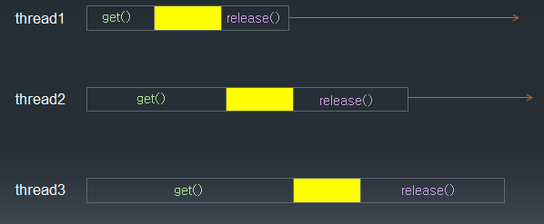
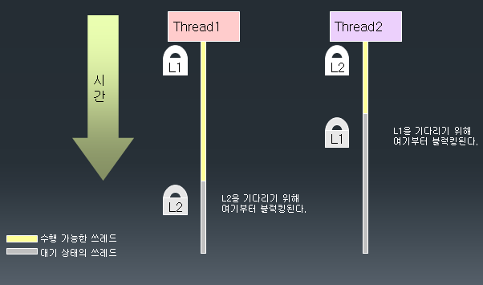

# 22. 멀티 Thread 프로그래밍에서의 동기화

## critical section 과 semaphore

- critical section  은 두 개 이상의 thread가 동시에 접근 하는 경우 문제가 생길 수 있기 때문에 동시에 접근할 수 없는 영역

- semaphore 는 특별한 형태의 시스템 객체이며 get/release 두 개의 기능이 있다.

- 한 순간 오직 하나의 thread 만이 semaphore를 얻을 수 있고, 나머지 thread들은 대기(blocking) 상태가 된다.

- semaphore를 얻은 thread 만이 critical section에 들어갈 수 있다.



- Park 과 ParkWife 가 동시에 Bank 자원에 접근하여 작업이 이루어지는 경우의 예제

```
class Bank{
	
	private int money = 10000;
	
	public synchronized  void saveMoney(int save){
		
		int m = this.getMoney();
		
		try {
			Thread.sleep(3000);
		} catch (InterruptedException e) {
			// TODO Auto-generated catch block
			e.printStackTrace();
		}
		
		setMoney( m + save);
	}
	
	public synchronized  void minusMoney(int minus){
		
		
			int m = this.getMoney();
			
			try {
				Thread.sleep(200);
			} catch (InterruptedException e) {
				// TODO Auto-generated catch block
				e.printStackTrace();
			}
			
			setMoney( m - minus);
			
			
	}
	
	public int getMoney(){
		return money;
	}
	
	public void setMoney(int money){
		this.money = money;
	}
}

class Park extends Thread{
	
	public  void run(){
		System.out.println("start save");
		SyncMain.myBank.saveMoney(3000);
		System.out.println("saveMoney(3000): " + SyncMain.myBank.getMoney() );	
	}
}

class ParkWife extends Thread{
	
	public void run(){
		System.out.println("start minus");
		SyncMain.myBank.minusMoney(1000);
		System.out.println("minusMoney(1000): " + SyncMain.myBank.getMoney() );
		
	}
	
}

public class SyncMain {

	public static Bank myBank = new Bank();
	
	public static void main(String[] args) throws InterruptedException {
		
		Park p = new Park();
		p.start();
		
		Thread.sleep(200);
		
		ParkWife pw = new ParkWife();
		pw.start();
	}

}
```

## 동기화 (synchronization)

- 두 개의 thread 가 같은 객체에 접근 할 경우, 동시에 접근 함으로써 오류가 발생 

- 동기화는 임계영역에 접근한 경우 공유자원을 lock 하여 다른 thread의 접근을 제어

- 동기화를 잘못 구현하면 deadlock에 빠질 수 있다.

## 자바에서는 synchronized 메서드나 synchronized 블럭을 사용

### synchronized 블럭

-현재 객체 또는 다른 객체를 lock으로 만든다.

```
synchronized(참조형 수식) {

      수행문;
}
```

### synchronized 메서드

- 객체의 메소드에 synchronized 키워드 사용

- 현재 이 메서드가 속해있는 객체에 lock을 건다.

- 자바에서는 deadlock을 방지하는 기술이 제공되지 않으므로 되도록이면 synchronized 메서드에서 다른 synchronized 메서드는 호출하지 않도록 한다.

- deadlock의 예




