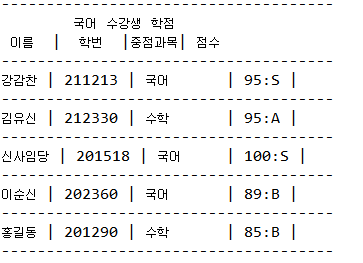

# 7. 인터페이스를 활용한 학점 산출 프로그램 만들기

## 문제 정의

- Good School 학교가 있습니다. 이 학교에는 5명의 학생들이 수업을 듣습니다. 과목은 국어와 수학이 있고, 각 학생은 두 과목을 모두 수강합니다. 

전공은 컴퓨터공학과 국어국문학 두 가지가 있습니다. 컴퓨터공학과 학생은 수학이 필수과목이고, 국어국문학과 학생은 국어가 필수 과목입니다. 

각 학생별로 한 개의 전공을 선택합니다. 

이번 학기 각 학생의 성적은 다음과 같습니다.

| 이름 | 학번 | 전공 | 필수 과목 | 국어 점수 | 수학 점수 |
| ------ | ------ | ------ | ------ | ------ | ------ |
| 강감찬 | 211213 | 국어국문학과 | 국어 | 95 | 56 |
| 김유신 | 212330 | 컴퓨터공학과 | 수학 | 95 | 98 |
| 신사임당 | 201518 | 국어국문학과 | 국어 | 100 | 88 |
| 이순신 | 202360 | 국어국문학과 | 국어 | 89 | 95 |
| 홍길동 | 201290 | 컴퓨터공학과 | 수학 | 83 | 56 |

- 학점을 부여하는 방벅은 여러 가지가 있습니다. 단순히 A,B,C,D,F를 부여하는 방법, A+, B-처럼 +/-를 사용하는 방법, Pass/Fail 만을 부여하는 방법등이 있습니다. 

여기 각 학생에게 학점을 부여하는 데 사용하는 정책은 두 가지입니다. 일반 과목이라면 A ~ F로, 필수 과목이라면 S ~ F 로 분류합니다. 점수에 따른 학점 부여기준은 

다음과 같습니다

- 필수 과목 학점 기준

| S | A | B | C | D | F |
| ------ | ------ | ------ | ------ | ------ | ------ |
| 95~100점 | 90~94점 | 80~89점 | 70~79점 | 60~69점 | 60점 미만 |

- 일반 과목 학점 기준

| A | B | C | D | F |
| ------ | ------ | ------ | ------ | ------ |
| 90~100점 | 80~89점 | 70~79점 | 55~69점 | 55점 미만 |

만약 똑같이 95점을 받은 경우, 필수 과목이라면 S를 받지만, 일반 과목은 A를 받습니다. 또한 56점을 받으면 필수 과목은 F이지만, 일반 과목은 D를 받습니다.

- 프로그램 구현 과제

위와 같이 주어진 성적과 각 과목에 대한 학점 정책에 따라 아래와 같이 학점 결과가 나올 수 있도록 구현합니다.

학점의 정책이 추가되는 경우와 과목이 추가되는 경우를 고려하여 객체를 설계하고 학점 정책에 대해서는 인터페이스를 선언하고 각 정책이 해당 인터페이스를 구현하도록 합니다. 

국어 과목 결과 



수학 과목 결과


## 클래스 정의 하고 관계도 그리기


Student.java

```
public class Student {
	
	private int studentId;    		//학번
	private String studentName;		//이름
	private Subject majorSubject;	//중점 과목
	
	//학생의 성적 리스트 
	//addSubjectSocre() 메서드가 호출되면 리스트에 추가 됨
	private ArrayList<Score> scoreList = new ArrayList<Score>(); 
	
	public Student( int studentId, String studentName, Subject majorSubject){
		this.studentId = studentId;
		this.studentName = studentName;
		this.majorSubject = majorSubject;
	}
	
	public void addSubjectScore(Score score){
		scoreList.add(score);
	}

	public int getStudentId() {
		return studentId;
	}

	public void setStudentId(int studentId) {
		this.studentId = studentId;
	}

	public String getStudentName() {
		return studentName;
	}

	public void setStudentName(String studentName) {
		this.studentName = studentName;
	}

	public Subject getMajorSubject() {
		return majorSubject;
	}

	public void setMajorSubject(Subject majorSubject) {
		this.majorSubject = majorSubject;
	}

	public ArrayList<Score> getScoreList(){
		return scoreList;
	}
	
	public void setScoreList(ArrayList<Score> scoreList) {
		this.scoreList = scoreList;
	}
}
```

Subject.java
```
public class Subject {
	private String subjectName;  //과목 이름
	private int subjectId;      // 과목 고유번호
	private int gradeType;      // 과목 평가 방법 기본은 A,B 방식
	
	//수강 신청한 학생 리스트
	//register() 메서드를 호출하면 리스트에 추가 됨
	private ArrayList<Student> studentList = new ArrayList<Student>();
	
	public Subject(String subjectName, int subjectId){
		this.subjectName = subjectName;
		this.subjectId = subjectId;
		this.gradeType = Define.AB_TYPE;   //기본적으로 A, B 타입
	}

	public String getSubjectName() {
		return subjectName;
	}

	public void setSubjectName(String subjectName) {
		this.subjectName = subjectName;
	}

	public int getSubjectId() {
		return subjectId;
	}

	public void setSubjectId(int subjectId) {
		this.subjectId = subjectId;
	}

	public ArrayList<Student> getStudentList() {
		return studentList;
	}

	public void setStudentList(ArrayList<Student> studentList) {
		this.studentList = studentList;
	}

	public int getGradeType() {
		return gradeType;
	}

	public void setGradeType(int gradeType) {
		this.gradeType = gradeType;
	}

	public void register(Student student){  //수강신청
		studentList.add(student);
	}
}
```

Score.java
```
public class Score {
	int studentId;   //학번
	Subject subject; //과목
	int point;      //점수
	
	public Score( int studentId, Subject subject, int point){
		this.studentId = studentId;
		this.subject = subject;
		this.point = point;
	}

	public int getStudentId() {
		return studentId;
	}

	public void setStudentId(int studentId) {
		this.studentId = studentId;
	}

	public Subject getSubject() {
		return subject;
	}

	public void setSubject(Subject subject) {
		this.subject = subject;
	}

	public int getPoint() {
		return point;
	}

	public void setPoint(int point) {
		this.point = point;
	}

	public String toString(){
		return "학번:" + studentId + "," + subject.getSubjectName() + ":" + point;
	}
}
```

Define.java
```
public class Define {

	public static final int KOREAN = 1001;  //국어
	public static final int MATH = 2001;    //수학
		
	public static final int AB_TYPE = 0;    // A, B, C
	public static final int SAB_TYPE = 1;   // S, A, B, c
	public static final int PF_TYPE = 2;   // P, F
	
}
```


## 학점 평가 정책 설계하고 구현하기

- 인터페이스 정의하기

점수에 따른 학점의 정책은 여러가지가 있을 수 있습니다. 인터페이스를 먼저 선언하고, 각 정책 클래스가 이를 구현하도록 합니다


GradeEvaluation.java
```
public interface GradeEvaluation {
	public String getGrade(int point);
}
```

 일반 과목 학점에 대한 클래스 구현

 BasicEvaluation.java
```
public  class BasicEvaluation implements GradeEvaluation{

	@Override
	public String getGrade(int point) {
		String grade;
		
		if(point >=90 && point <=100)
			grade = "A";
		else if(point >=80 && point <=89)
			grade = "B";
		else if(point >=70 && point <=79)
			grade = "C";
		else if(point >=55 && point <=69)
			grade = "D";
		else
			grade = "F";
		return grade;
	}
}
```


 필수 과목 학점에 대한 클래스 구현

MajorEvaluation.java
```
public class MajorEvaluation implements GradeEvaluation{

	@Override
	public String getGrade(int point) {
		String grade;
		if(point >=95 && point <=100)
			grade = "S";
		else if(point >=90 && point <=94)
			grade = new String("A");
		else if(point >=80 && point <=89)
			grade = "B";
		else if(point >=70 && point <=79)
			grade = "C";
		else if(point >=60 && point <=69)
			grade = "D";
		else
			grade = "F";
		return grade;
	}
}
```

## 리포트 클래스 

- 학점 평가에 대한 클래스들을 인스턴스화 하고 이에 대한 배열을 만들어 각 과목에 점수를 산정할 때 필수 과목인지 일반 과목인지에 따라 각 정책 클래스가 학점을 평가할 수 있도록 구현 합니다.

- 전반적인 리포트의 생성은 header부분, 본문 부분, tail 부분으로 구성합니다.

- StringBuffer 클래스를 이용하여 모든 리포트의 내용을 만들고 난후 toString()을 호출 하여 String 클래스로 반환합니다.

GenerateGradeReport.java
```
public class GenerateGradeReport {

	School school = School.getInstance();
	public static final String TITLE = " 수강생 학점 \t\t\n";
	public static final String HEADER = " 이름  |  학번  |중점과목| 점수   \n";
	public static final String LINE = "-------------------------------------\n";
	private StringBuffer buffer = new StringBuffer();  
	
	public String getReport(){
		ArrayList<Subject> subjectList = school.getSubjectList();  // 모든 과목에 대한 학점 산출
		for( Subject subject : subjectList) {
			makeHeader(subject);
			makeBody(subject);
			makeFooter();
		}
		return buffer.toString();  // String 으로 반환
	}
	
	public void makeHeader(Subject subject){
		buffer.append(GenerateGradeReport.LINE);
		buffer.append("\t" + subject.getSubjectName());
		buffer.append(GenerateGradeReport.TITLE );
		buffer.append(GenerateGradeReport.HEADER );
		buffer.append(GenerateGradeReport.LINE);
	} 
	
	public void makeBody(Subject subject){
		
		ArrayList<Student> studentList = subject.getStudentList();  // 각 과목의 학생들
		
		for(int i=0; i<studentList.size(); i++){
			Student student = studentList.get(i);
			buffer.append(student.getStudentName());
			buffer.append(" | ");
			buffer.append(student.getStudentId());
			buffer.append(" | ");
			buffer.append(student.getMajorSubject().getSubjectName() + "\t");
			buffer.append(" | ");
			
			getScoreGrade(student, subject.getSubjectId());  //학생별 해당과목 학점 계산
			buffer.append("\n");
			buffer.append(LINE);
		}
	}
	
	public void getScoreGrade(Student student, int subjectId){
		
		ArrayList<Score> scoreList = student.getScoreList();
		int majorId = student.getMajorSubject().getSubjectId();
		
		GradeEvaluation[] gradeEvaluation = {new BasicEvaluation(), new MajorEvaluation()};  //학점 평가 클래스들
		
		for(int i=0; i<scoreList.size(); i++){  // 학생이 가진 점수들 
			
			Score score = scoreList.get(i);
			if(score.getSubject().getSubjectId() == subjectId) {  // 현재 학점을 산출할 과목 
				String grade;
				if(score.getSubject().getSubjectId() == majorId)  // 중점 과목인 경우
					grade = gradeEvaluation[Define.SAB_TYPE].getGrade(score.getPoint());  //중점 과목 학점 평가 방법
				else
					grade = gradeEvaluation[Define.AB_TYPE].getGrade(score.getPoint()); // 중점 과목이 아닌 경우
				buffer.append(score.getPoint());
				buffer.append(":");
				buffer.append(grade);
				buffer.append(" | ");
			}
		}
	}
	
	public void makeFooter(){
		buffer.append("\n");
	}
}
```


## 프로그램 테스트 하기

- 주어진 테이터에 기반하여 Student, Subject, Score 객체를 직접 만들어 각 과목에 따른 학점의 결과가 잘 출력되는지 확인 합니다.

- 모든 학생과 과목을 관리하는 School 맥체를 만듭니다. 

School.java
```
public class School {

	private static School instance = new School();
	
	private static String SCHOOL_NAME = "Good School";
	private ArrayList<Student> studentList = new ArrayList<Student>();
	private ArrayList<Subject> subjectList = new ArrayList<Subject>();
	
	private School(){}
	
	public static School getInstance(){
		if(instance == null) 
			instance = new School();
		return instance;
	}
	
	public ArrayList<Student> getStudentList(){
		return studentList;
	}
	
	public void addStudent(Student student){
		studentList.add(student);
	}

	public void addSubject(Subject subject) {
		subjectList.add(subject);
	}

	public ArrayList<Subject> getSubjectList() {
		return subjectList;
	}

	public void setSubjectList(ArrayList<Subject> subjectList) {
		this.subjectList = subjectList;
	}
}
```

TestMain.java
```
public class TestMain {

	School goodSchool = School.getInstance();
	Subject korean;
	Subject math;

	GenerateGradeReport gradeReport = new GenerateGradeReport();
	
	public static void main(String[] args) {
		
		TestMain test = new TestMain();
		
		test.creatSubject();
		test.createStudent();
		
		String report = test.gradeReport.getReport(); //성적 결과 생성
		System.out.println(report); // 출력
		
	}
	
	//테스트 과목 생성
	public void creatSubject(){
		
		korean = new Subject("국어", Define.KOREAN);
		math = new Subject("수학", Define.MATH);
		
		goodSchool.addSubject(korean);
		goodSchool.addSubject(math);
	}
	
	//테스트 학생 생성
	public void createStudent(){
		
		Student student1 = new Student(211213, "강감찬", korean  );
		Student student2 = new Student(212330, "김유신", math  );
		Student student3 = new Student(201518, "신사임당", korean  );
		Student student4 = new Student(202360, "이순신", korean  );
		Student student5 = new Student(201290, "홍길동", math );
		
		goodSchool.addStudent(student1);
		goodSchool.addStudent(student2);
		goodSchool.addStudent(student3);
		goodSchool.addStudent(student4);
		goodSchool.addStudent(student5);

		korean.register(student1);
		korean.register(student2);
		korean.register(student3);
		korean.register(student4);
		korean.register(student5);
		
		math.register(student1);
		math.register(student2);
		math.register(student3);
		math.register(student4);
		math.register(student5);
		
		addScoreForStudent(student1, korean, 95); 
		addScoreForStudent(student1, math, 56);	
		
		addScoreForStudent(student2, korean, 95); 
		addScoreForStudent(student2, math, 95);	
		
		addScoreForStudent(student3, korean, 100); 
		addScoreForStudent(student3, math, 88);	
		
		addScoreForStudent(student4, korean, 89); 
		addScoreForStudent(student4, math, 95);	
		
		addScoreForStudent(student5, korean, 85); 
		addScoreForStudent(student5, math, 56);	
	}

	//과목별 성적 입력
	public void addScoreForStudent(Student student, Subject subject, int point){
		
		Score score = new Score(student.getStudentId(), subject, point);
		student.addSubjectScore(score);
		
	}
}
```

## 프로그램 업그레이드 하기

- 과목과 학점 정책이 추가되는 경우

방송댄스 과목이 새로 개설되고 이 과목의 학점 평가 정책은 pass/fail 로 정해졌다고 합니다. 70점 이상인 경우는 pass, 미만인 경우는 fail입니다.

전체 5명 학생중 3명만이 이 과목을 수강신청 했습니다. 추가된 요구사항이 잘 반영되도록 구현하세요

- 상수값 추가하기
Define.java
```
public class Define {

	public static final int KOREAN = 1001;  //국어
	public static final int MATH = 2001;    //수학
	public static final int DANCE = 3001;   //방송댄스
		
	public static final int AB_TYPE = 0;    // A, B, C
	public static final int SAB_TYPE = 1;   // S, A, B, c
	public static final int PF_TYPE = 2;   // P, F
	
}
```

- GradeEvaluation 인터페이스를 구현한 Pass/Fail BasicEvaluation
PassFailEvaluation
```
public class PassFailEvaluation implements GradeEvaluation{

	@Override
	public String getGrade(int point) {
		if (point >= 70) 
			return "P";
		else
		    return "F";
	}
}
```

- 리포트 클래스 추가할 부분

학점 평가 정책 인스턴스 배열에 새로 추가한 정책에 대한 인스턴스를 추가합니다. 

또한 Subject에 대한 학점 정책이 PF_TYPE인 경우만 해당 클래스가 적용되도록 합니다.

GenerateGradeReport
```
...

public void getScoreGrade(Student student, Subject subject){
		
		ArrayList<Score> scoreList = student.getScoreList();
		int majorId = student.getMajorSubject().getSubjectId();
		
		GradeEvaluation[] gradeEvaluation = {new BasicEvaluation(), new MajorEvaluation(), new PassFailEvaluation()};  //학점 평가 클래스들
		
		for(int i=0; i<scoreList.size(); i++){  // 학생이 가진 점수들 
			
			Score score = scoreList.get(i);
			if(score.getSubject().getSubjectId() == subject.getSubjectId()) {  // 현재 학점을 산출할 과목 
				String grade;
		
				if(subject.getGradeType() == Define.PF_TYPE) {
					grade = gradeEvaluation[Define.PF_TYPE].getGrade(score.getPoint());
				}
				else {
				    if(score.getSubject().getSubjectId() == majorId)  // 중점 과목인 경우
					    grade = gradeEvaluation[Define.SAB_TYPE].getGrade(score.getPoint());//중점 과목 학점 평가 방법  
				    else
				    	grade = gradeEvaluation[Define.AB_TYPE].getGrade(score.getPoint()); // 중점 과목이 아닌 경우
				}
				buffer.append(score.getPoint());
				buffer.append(":");
				buffer.append(grade);
				buffer.append(" | ");
			}
		}
	}

```
- 테스트 클래스에 문제의 셋을 추가하여 학점을 출력해 봅니다. 

TestMain.java
```
public class TestMain {

	School goodSchool = School.getInstance();
	Subject korean;
	Subject math;
	Subject dance;
	
	GenerateGradeReport gradeReport = new GenerateGradeReport();
	
	public static void main(String[] args) {
		
		TestMain test = new TestMain();
		
		test.creatSubject();
		test.createStudent();
		
		String report = test.gradeReport.getReport(); //성적 결과 생성
		System.out.println(report); // 출력
		
	}
	
	//테스트 과목 생성
	public void creatSubject(){
		
		korean = new Subject("국어", Define.KOREAN);
		math = new Subject("수학", Define.MATH);
		dance = new Subject("방송댄스", Define.DANCE);
		
		dance.setGradeType(Define.PF_TYPE);
		
		goodSchool.addSubject(korean);
		goodSchool.addSubject(math);
		goodSchool.addSubject(dance);
		
	}
	
	//테스트 학생 생성
	public void createStudent(){
		
		Student student1 = new Student(211213, "강감찬", korean  );
		Student student2 = new Student(212330, "김유신", math  );
		Student student3 = new Student(201518, "신사임당", korean  );
		Student student4 = new Student(202360, "이순신", korean  );
		Student student5 = new Student(201290, "홍길동", math );
		
		goodSchool.addStudent(student1);
		goodSchool.addStudent(student2);
		goodSchool.addStudent(student3);
		goodSchool.addStudent(student4);
		goodSchool.addStudent(student5);

		korean.register(student1);
		korean.register(student2);
		korean.register(student3);
		korean.register(student4);
		korean.register(student5);
		
		math.register(student1);
		math.register(student2);
		math.register(student3);
		math.register(student4);
		math.register(student5);
		
		//세 명만 등록
		dance.register(student1);
		dance.register(student2);
		dance.register(student3);
		
		addScoreForStudent(student1, korean, 95); 
		addScoreForStudent(student1, math, 56);	
		
		addScoreForStudent(student2, korean, 95); 
		addScoreForStudent(student2, math, 95);	
		
		addScoreForStudent(student3, korean, 100); 
		addScoreForStudent(student3, math, 88);	
		
		addScoreForStudent(student4, korean, 89); 
		addScoreForStudent(student4, math, 95);	
		
		addScoreForStudent(student5, korean, 85); 
		addScoreForStudent(student5, math, 56);	
		
		addScoreForStudent(student1, dance, 95);	
		addScoreForStudent(student2, dance, 85); 
		addScoreForStudent(student3, dance, 55);	
		
	}

	//과목별 성적 입력
	public void addScoreForStudent(Student student, Subject subject, int point){
		
		Score score = new Score(student.getStudentId(), subject, point);
		student.addSubjectScore(score);
		
	}
}
```


