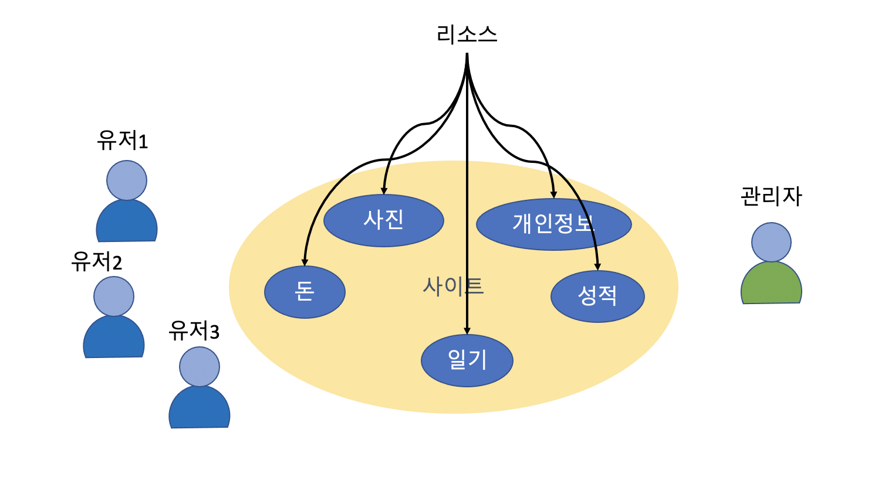

# 스프링 부트 시큐리티 강의 (옥탑방개발자)

스프링 부트 시큐리티에 대한 강의 자료를 정리하였습니다.

## 사이트 환경

인터넷에 사이트를 개발하고 서비스를 제공하게 되면, 서비스 안에는 서비스를 사용하는 User 들의 리소스(정보)들이 들어 있게 됩니다. 관리자는 이들 리소스들을 위임받아 관리하는 것이기 때문에, 악의적인 사용자들로부터 리소스를 잘 보호해야 하고, 효과적으로 관리해 주어야 합니다.

스프링 부트의 security 는 이들 리소스를 잘 보호할 수 있는 기본 메커니즘과 라이브러리를 제공합니다.
이 강의는 이들 라이브러리를 어떻게 이해햐야 하는지, 그리고 어떻게 잘 사용할 수 있는지에 대한 내용을 담은 것입니다.

## 선수 지식

이 강의는 Spring Security를 실전에서 능숙하게 다루는 것을 목표로 합니다. 그렇기 때문에 아래와 같은 선수지식들을 필요로 합니다. 혹시 이해가 부족하거나 잘 모르는 부분이 있다면 미리 공부를 하고 이 강의를 들으실 것을 권장드립니다.

- Java : jdk 11 이상 (modern java 에 대해 알아야 함)
- spring boot : 스프링 애플리케이션 프레임워크
- gradle : 프로젝트 관리 및 빌드
- JUnit5(Jupyter)와 spring test : 기본적인 기능 테스트를 위해 필요함.
- Spring 관련 전반 지식 : Web MVC, RESTFul 서비스, Spring Data JPA, AOP, SpEL
- lombok : Getter/Setter/Builter 메소드 등 지원
- thymeleaf : 웹 프로그램을 지원함
- mysql : 데이터 테스트
- IntelliJ IDE

## 이 강의에서 다룰 내용

- Gradle 멀티 프로젝트 구성과 모듈 프로젝트 개발
- Spring Security의 기본 구조
- Spring Security 를 활용한 로그인 방법 (Authentication)
- Spring Security 를 활용한 권한 체크 방법 (Authorization)
- Ajax 와 OAuth2 인증 : ajax / OAuth2 인증 방식

스프링 인증(authentication)과 인가라는 말을 많이 쓰는데, 인가라는 말보다는 권한(authorization) 이라는 용어로 얘기를 하도록 하겠습니다. 권한(authorization)은 역할(role)보다 더 자세한 개념으로 최근의 추세는 권한을 Prefix를 주어 자세히 설정하는 경향이 있습니다.

## 실전 프로젝트

강의에 사용한 소스는 아래 github 사이트를 통해 받아보실 수 있습니다. master 에는 초기 설정만 되어 있구요.. 각 각의에서 지정한 branch 로 이동을 하셔서 테스트를 진행하실 수 있습니다.

프로젝트 소스 : https://github.com/jongwon/sp-fastcampus-spring-sec
