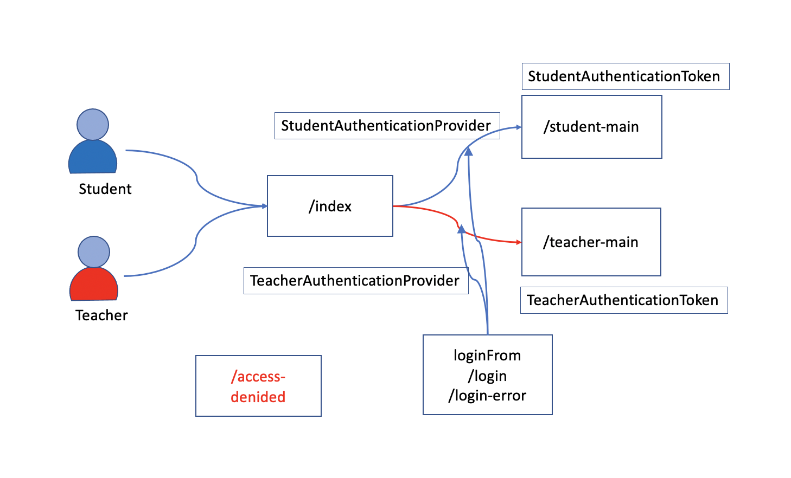

# Authenticatio 메커니즘

## 학생과 선생님 로그인 구현

- StudentAuthenticationToken 과 TeacherAuthenticationToken 을 각각 Authentication 으로 한다.
- StudentManager와 TeacherManager 를 각각 AuthenticationProvider 로 구현한다.

## 문제점

- UsernamePasswordAuthenticationFilter 가 해주던 일을 직접 구현해야 한다.
  - CustomLoginFilter 를 쓸 경우 successHandler와 failureHandler 를 별도로 구현해 주어야 한다.
  - default 페이지와 caching 된 request 페이지로 redirect 하는 기능도 직접 구현해야 한다.
  - 현재로서는 CustomLoginFilter 와 UsernamePasswordAuthenticationFilter 를 동시에 사용하는 것이 가장 현명한 대안이다.
- 가능한 UsernamePasswordAuthenticationFilter 를 재활용하는 방안을 강구해야 한다.
