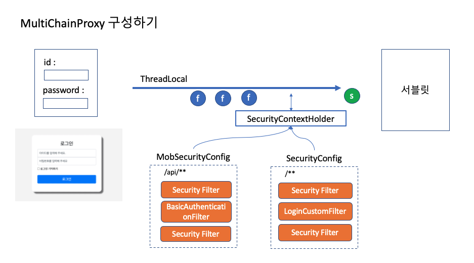

# 웹과 모바일 서비스

- 상황

  - 웹으로 잘 만든 사이트를 모바일로도 서비스해야 한다.
  - 그런데, 모바일 클라이언트 브라우저를 이용한 하이브리드 방식으로 개발을 한다. (세션이용이 가능함)
  - 그런데, 시간이 없어서 JWT 토큰 기반으로 만들기가 어렵다.
  - Basic 토큰을 이용해 기존 서비스를 api로 이용하고 싶다.

- 시나리오
  - 선생님과 학생이 각각 로그인을 한다.
  - 선생님은 모바일을 통해 학생 리스트를 조회할 수 있다.

## 구현하기

- 멀티 체인을 구성해 서비스를 서비스 한다.
  

- 웹 리소스를 재사용하기 위해 student-teacher 웹모듈을 만든다.
