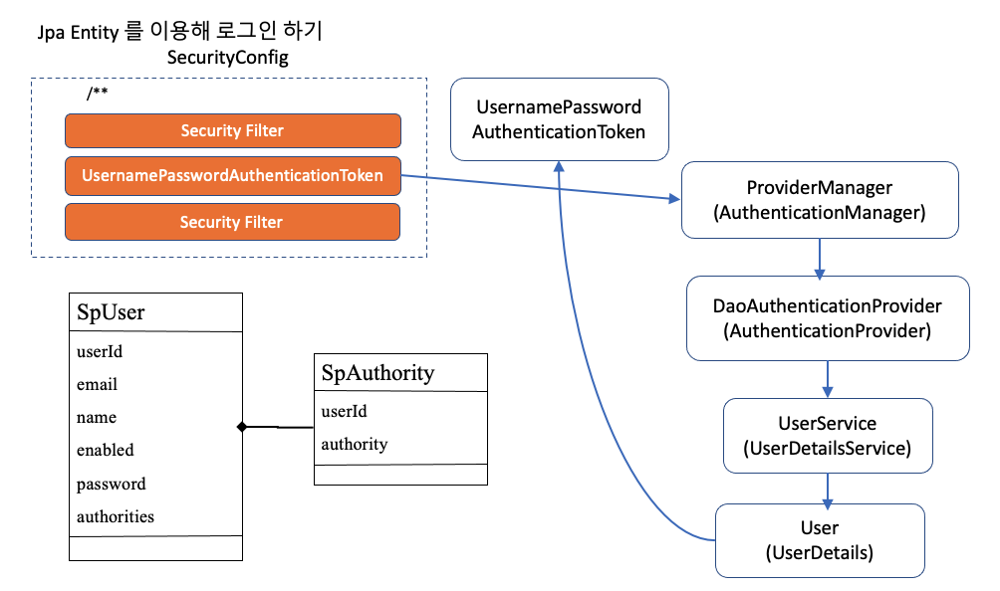

# DaoAuthenticationManager와 UserDetailsService

이제까지 User 정보는 모두 InMemory 상태에서 처리를 했습니다.
그런데, 실제 개발 상황에서 이렇게 쓰는 곳은 없습니다.
대부분 Mysql이나 Oracle 과 같은 RDBMS를 쓰거나, MongoDB 와 같은 기타 데이터베이스를 사용해 사용자를 관리합니다.

실제로 스프링 시큐리티를 써서 서비스를 만들라고 하면, 대부분의 개발자들은 UserDetails 를 구현한 User 객체와 UserDetailsService 부터 만듭니다.
왜냐하면, UserDetailsService와 UserDetails 구현체만 구현하면 스프링 시큐리티가 나머지는 쉽게 쓸 수 있도록 도움을 많이 주기 때문입니다.
그런 다음, 나머지 부분은 하나하나 설정을 배워가면서 처리하는 되기 때문이죠.

그렇다면 우리도 UserDetailsService와 UserDetails를 구현해 보도록 하겠습니다.

## 실습하기

- login-basic 프로젝트의 리소스와 컨트롤러를 재사용하겠습니다.

  

- SpUser 객체와 SpAuthority 대한 Entity 객체 정의는 아래와 같이 정의 합니다.

```java

@Entity
@Table(name="sp_user")
public class SpUser implements UserDetails {

    @Id
    @GeneratedValue(strategy = GenerationType.IDENTITY)
    private Long userId;

    private String email;

    private String password;

    @OneToMany(fetch = FetchType.EAGER, cascade = CascadeType.ALL)
    @JoinColumn(name = "user_id", foreignKey = @ForeignKey(name="user_id"))
    private Set<SpAuthority> authorities;

    private boolean enabled;

    @Override
    public String getUsername() {
        return email;
    }

    @Override
    public boolean isAccountNonExpired() {
        return enabled;
    }

    @Override
    public boolean isAccountNonLocked() {
        return enabled;
    }

    @Override
    public boolean isCredentialsNonExpired() {
        return enabled;
    }

}
```

```java

@Entity
@Table(name="sp_user_authority")
@IdClass(SpAuthority.class)
public class SpAuthority implements GrantedAuthority {

    @Id
    @Column(name="user_id")
    private Long userId;

    @Id
    private String authority;


}


```

## h2 DB 설정하기

```groovy

dependencies{
  runtime("com.h2database:h2")
}
```

```yml
spring:
  h2:
    console:
      enabled: true
      path: /h2-console

  datasource:
    url: jdbc:h2:mem:userdetails-test;
    driverClassName: org.h2.Driver
    username: sa
    password:

  jpa:
    database-platform: org.hibernate.dialect.H2Dialect
```

## 실습 하기

- login-userdetails 폴더를 만든다.
- user-admin comp 모듈을 만들고, SpUser, SpAuthority Entity와 Repository 를 만든다.
- h2 DB 를 세팅한다.
