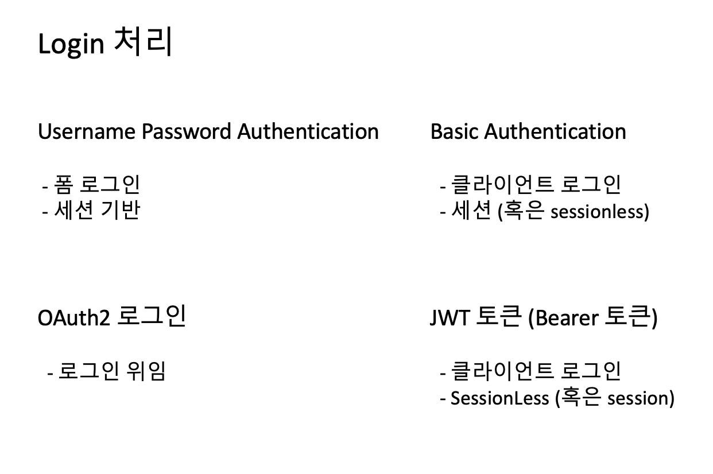
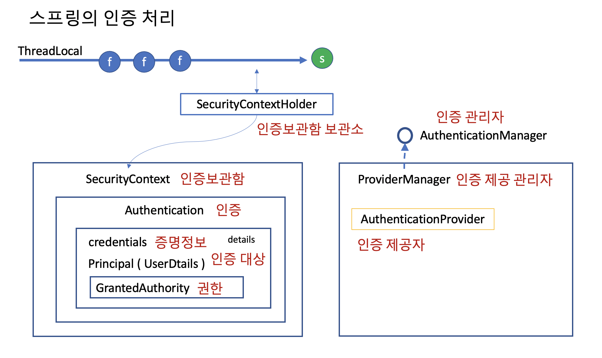
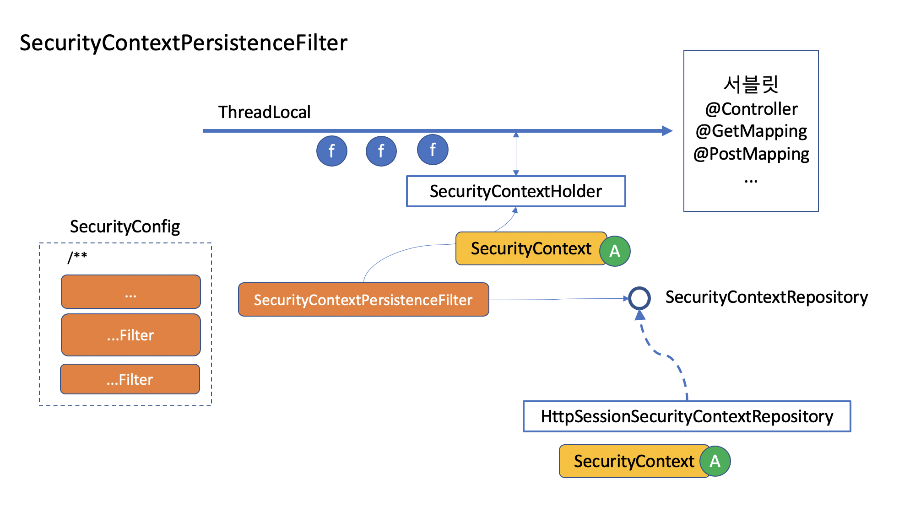
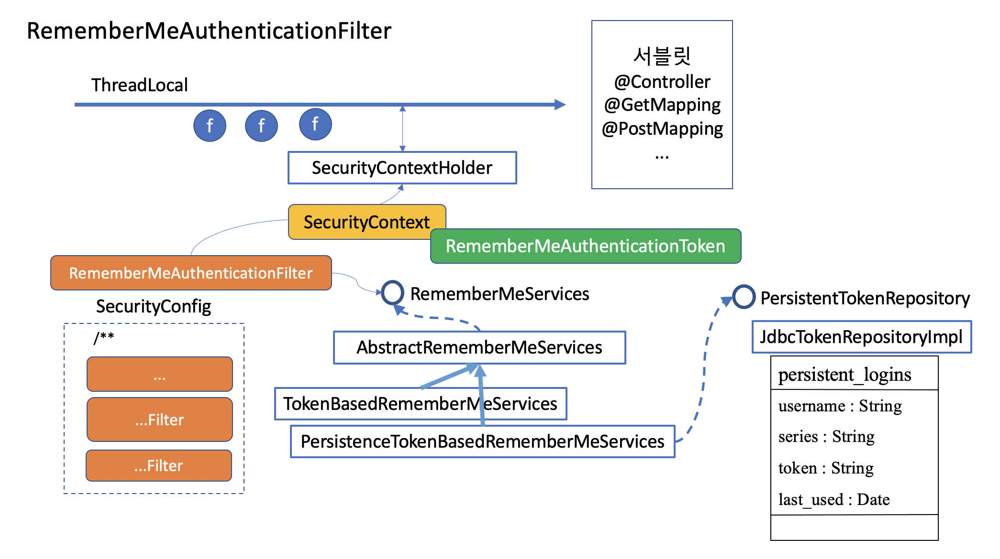

# 로그인을 지원하기 위한 필터들

## 스프링이 지원하는 로그인 방식들

- 스프링은 아래와 같은 로그인 방식들을 지원합니다.

  

- 스프링이 인증 처리는 세션과는 별도로 동작하도록 설계되어 있습니다. 그래서 session 을 사용하건 사용하지 않건 같은 Authentication과 AuthenticationProvider 를 사용할 수 있습니다.

  

- 스프링의 인증을 유지시켜주기 위해서는 session 을 이용하는 것이 개발자에게는 여러모로 편리합니다. 이후 인증은 서버가 메모리를 소모해서 세션객체를 가지고 유지시켜주는 작업을 하도록 할 수 있습니다. 세션은 브라우저의 쿠키에 JSESSIONID 값을 심어놓고, 브라우저와 서버가 이 값을 주고 받으면서 세션을 보장받을 수 있습니다.

- 그런데 서버의 세션 정책과 스프링의 인증 체계가 서로 맞물려 동작하도록 하려면 SecurityContextPersistenceFilter 와 RememberMeAuthenticationFilter, AnonymousAuthenticationFilter 등과 같이 인증을 보조해 주는 다른 필터들의 도움을 받아야 합니다.

## SecurityContextPersistenceFilter

- SecurityContextRepository 에 저장된 SecurityContext 를 Request의 LocalThread에 넣어주었다가 뺏는 역할을 한다. doFilter 메소드를 따라가보면 알 수 있다. 세션에 SecurityContext를 보관했다가 다음 request에서 넣어줍니다.

  

## RememberMeAuthenticationFilter

- 인증 정보를 세션 관리하는 경우, 세션 timeout이 발생하게 도면, remember-me 쿠키를 이용해 로그인을 기억했다 자동으로 재로그인 시켜주는 기능입니다.

  

  - key : Hash 암/복호화에 사용할 키 값
  - token-validity-seconds : 토큰 유효 기간
  - authentication-success-handler-ref : 핸들러를 커스마이징 했다면 로그인 성공 후 수행할 로직
  - user-service-ref : UserDetailsService를 커스터마이징 했을 경우 주입

- TokenBasedRememberMeServices : 토큰 기반
  - 포멧 : 아이디:만료시간:Md5Hex(아이디:만료시간:비밀번호:인증키)
  - 만약 User가 password 를 바꾼다면 토큰을 쓸 수 없게 됩니다.
  - 기본 유효기간은 14일 이고 설정에서 바꿀 수 있습니다.
  - 약점 : 탈취된 토큰은 비밀번호를 바꾸지 않는한 유효기간동안 만능키가 됩니다.
- PersistenceTokenBasedRememberMeServices:
  - 포멧 : series:token
  - 토큰에 username이 노출되지 않고, 만료시간도 노출되지 않습니다. 만료시간은 서버에서 정하고 노출하지 않고 서버는 로그인 시간만 저장합니다.
  - series 값이 키가 된다. 일종의 채널이라고 보면 편리하다.
  - 대신 재로그인이 될 때마다 token 값을 갱신해 줍니다. 그래서 토큰이 탈취되어 다른 사용자가 다른 장소에서 로그인을 했다면 정상 사용자가 다시 로그인 할 때, CookieTheftException 이 발생하게 되고, 서버는 해당 사용자로 발급된 모든 remember-me 쿠키값들을 삭제하고 재로그인을 요청하게 됩니다.
  - InmemoryTokenRepository 는 서버가 재시작하면 등록된 토큰들이 사라집니다. 따라서 자동로그인을 설정했더라도 다시 로그인을 해야 합니다. 재시작 후에도 토큰을 남기고 싶다면 JdbcTokenRepository를 사용하거나 이와 유사한 방법으로 토큰을 관리해야 합니다.
  - 로그아웃하게 다른 곳에 묻혀놓은 remember-me 쿠키값도 쓸모가 없게 됩니다. 만약 다른 곳에서 remember-me로 로그인한 쿠키를 살려놓고 싶다면, series 로 삭제하도록 logout 을 수정해야 합니다.
- 특징
  - Remeberme로 로그인한 사용자는 UsernamePasswordAuthenticationToken 이 아닌 RememberMeAuthenticationToken 으로 서비스를 이용하는 것입니다. 같은 사용자이긴 하지만, 토큰의 종류가 다르게 구분되어 있습니다.

## AnonymousAuthenticationFilter

- 로그인 하지 않은 사용자 혹은 로그인이 검증되지 않은 사용자는 기본적으로 AnonymousAuthenticationToken 을 발급해 줍니다. anonymous를 허용한 곳만 다닐 수 있게 하겠다는 것입니다.
- 익명사용자의 권한을 별도로 설정할 수 있고, 익명사용자에게 주는 principal 객체도 설계해서 대체해 줄 수 있습니다.

## 참고

- PersistenceTokenBasedRememberMe 포멧 : https://gist.github.com/oleg-andreyev/9dcef18ca3687e12a071648c1abff782
- https://www.baeldung.com/spring-security-persistent-remember-me
- https://m.blog.naver.com/PostView.nhn?blogId=ppuagirls&logNo=221401627835&proxyReferer=https:%2F%2Fwww.google.com%2F
- https://syaku.tistory.com/328
- RememberMe 쿠키가 있는 경우에만 Persistence 를 지우도록 하는 방법 : https://stackoverflow.com/questions/50322138/concurrent-session-and-remember-me
