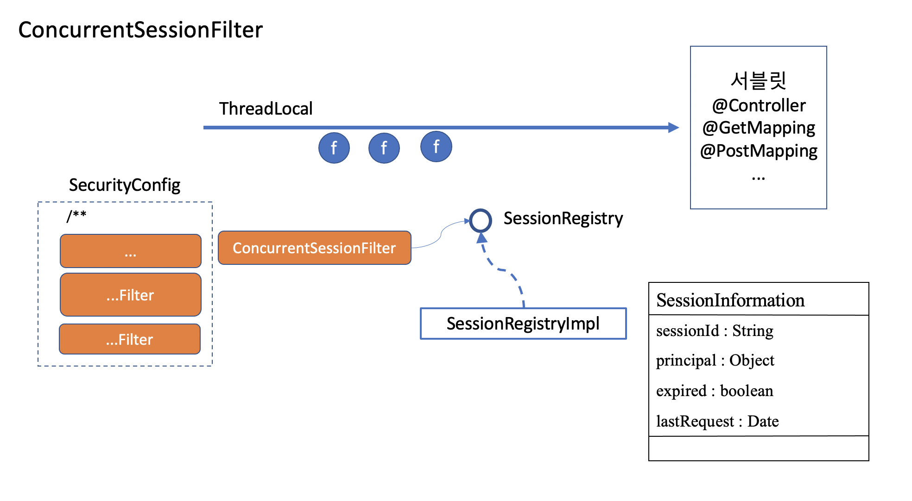
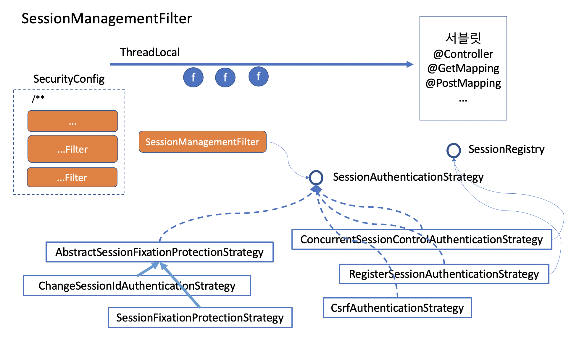

# 세션 관리

서버는 기본적으로 사용자를 보면서 판단할 수 없습니다. 서버는 로그인을 통해 요청을 보낸 사용자를 구분합니다. 하지만 모든 요청에 아이디/패스워드를 물어볼 수는 없습니다. 그래서 토큰을 발급하고, 세션에는 토큰을 저장해 놓고 세션이 유지되는 동안, 혹은 remember-me 토큰이 있다면 해당 토큰이 살아있는 동안 로그인 없이 해당 토큰만으로 사용자를 인증하고 요청을 처리해 줍니다.

그래서 악의적으로 정보를 취하고자 하는 사람들(해커)은 세션을 탈취하기 위한 시도를 합니다. 따라서 세션 관리에 헛점이 없도록 구성의 기본 내용을 잘 알아야 합니다.

## ConcurrentSessionFilter

- SessionRegistry 를 사용한다. 이 빈을 이용해 세션사용자(SessionInformation)를 모니터링 할 수 있습니다.

  

- 만료된 세션에 대한 요청인 경우 세션 즉시 종료. 세션 만료에 대한 판단은 SessionManagementFilter 의 ConcurrentSessionControlAuthenticationStrategy 에서 처리합니다.

- 문제점
  - 서블릿 컨테이너(톰켓)로 부터 HttpSessionEventPublisher 를 리스닝 하도록 listener로 등록해야 합니다.
  - 톰켓의 세션과는 별도로 session을 SessionRegistry의 SessionInformation 에서 관리합니다.
  - SessionRegistry 의 세션 정보를 expire 시키면 톰켓에서 세션을 아무리 허용하더라도 애플리케이션 내로 들어와서 활동할 수 없습니다.
  - SessionRegistry 에는 Authentication 으로 등록된 사용자만 모니터링 합니다.

## SessionManagementFilter

- SessionAuthenticationStrategy 에서 여러가지 세션 인증 정책을 관리하도록 설정할 수 있습니다.

  - 세션 생성 정책
  - 세션 아이디 고정 설정
  - 동시접근 허용 문제
  - 세션 타임아웃 문제

  ```java
  http
    .sessionManagement(session->session
        .sessionFixation(fix->fix.changeSessionId())
        .maximumSessions(1)
        .key("remember-me")
        .tokenValiditySeconds(30*24*60*60)
        .maxSessionsPreventsLogin(false)
        .expiredUrl("/session-expired")
    )
  ```

  

- SessionFixationProtectionStrategy : 세션 고정 문제 해결

  1. 브라우저로 서버에 접속합니다.
  2. 정상 사용자의 브라우저에 내 브라우저의 세션값을 주입합니다.
  3. 정상 사용자가 해당 사이트에 로그인 하기만 하면 내 브라우저로 마치 인증된 사용자인 것처럼 리소스에 접근할 수 있습니다.

  - 해결방법 : 서버에서 로그인을 시도하면 이전 세션을 invalidate 시키고 새로운 세션을 만들어서 인증을 해줍니다.

- ConcurrentSessionControlAuthenticationStrategy : 동시 세션의 개수 제한. RegisterSessionAuthenticationStrategy 와 함께 SessionRegistry 를 참조해 작업 합니다.

- 세션 정책

  - Always : 항상 세션을 생성함
  - If_Required : 필요시 생성
  - Never : 생성하지 않음. 존재하면 사용함.
  - Stateless : 생성하지 않음. 존재해도 사용하지 않음.
  - session

# 세션관리 실습

- 실시간으로 로그인한 사용자들의 세션 개수와 로그인한 URL을 모니터링 한다.
- 3명의 사용자를 만든다.
- 동시접속 제어를 테스트 한다.
- RememberMe 도 설정한다.
- remember me를 설정했을때
