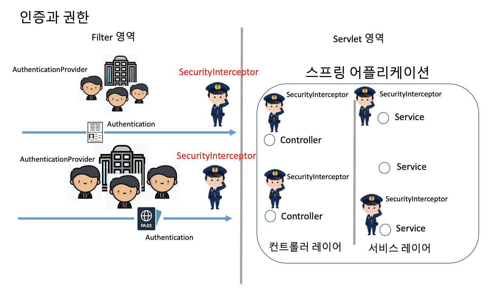
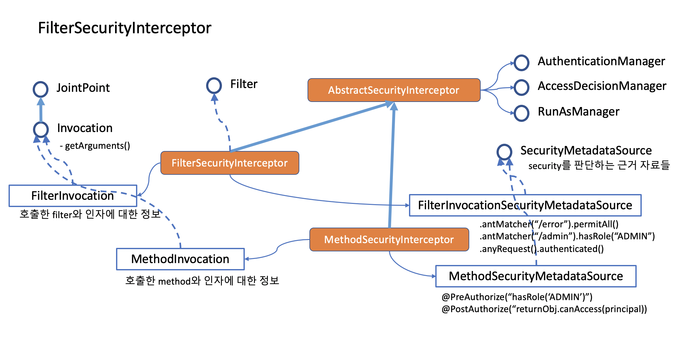
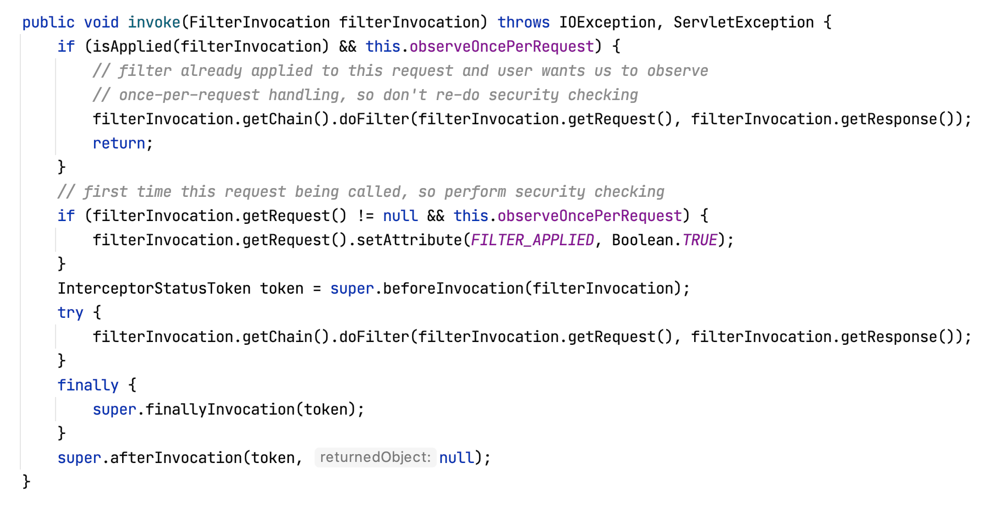
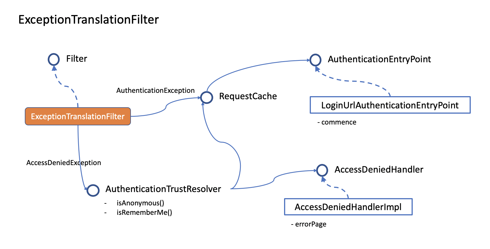

# 권한 체크와 오류 처리

스프링의 핵심은 빈을 담고 있는 컨테이너라고 할 수 있습니다. 컨테이너 안에 빈들을 담은 이유는 컨테이너가 처리로직에 직접 관여할 수 있도록 하기 위해서 입니다. 개발자는 비즈니스 코드와 처리방식을 컨테이너에게 알려주고 나머지는 컨테이너가 다 알아서 해줍니다.

스프링은 코드가 스파게티가 되지 않도록 관심사 분리 원칙을 강조합니다. AOP(Aspect Oriented Programming)의 철학이 그대로 여기저기에 녹아들어가 있습니다. 스프링 Security도 그 중에 하나입니다.

## 스프링의 인증과 권한

  

---

## FilterSecurityInterceptor

  

- SecurityInterceptor : AccessDecisionManager 를 통해 권한여부를 판단하고 통과시켜주거나 Deny 합니다.
- 주요 처리 로직이 아래와 같습니다.
  
  - beforeInvodation : Security Config 에서 설정한 접근 제한을 체크합니다.
  - finallyInvocation : RunAs 권한을 제거합니다.
  - afterInvocation : AfterInvocationManager 를 통해 체크가 필요한 사항을 체크합니다. 특별히 설정하지 않으면 AfterInvocationManager 는 null 입니다.

---

## ExceptionTranslationFilter

이 필터는 FilterSecurityInterceptor 나 애플리케이션에서 올라오는 오류를 가로채 처리하는 작업을 합니다.

- AuthenticationException과 AccessDeniedException만 처리합니다.
- 그 밖의 오류는 보통 ControllerAdvice 를 이용해서 처리하는 것을 권장합니다.

  

### 401 에러와 403 에러

- 401 : 인증 실패

  - AuthenticationException
  - 다시 로그인 해야 하므로 AuthenticationEntryPoint 로 처리를 넘깁니다.
  - AuthenticationException이 발생했다고 서버가 반드시 401 에러를 내려보내는 것은 아닙니다. 해당 에러를 401 오류로 처리하는 코드를 넣어햐 합니다. 필요에 따라서는 403 오류코드로 처리하기도 합니다.

- 403 : 권한 없음

  - AccessDeniedException
  - Anonymous 유저이거나 RememberMe 유저이면 다시 로그인 하도록 AuthenticationEntryPoint 로 처리를 넘깁니다.
  - 그 밖의 유저는 권한없음 페이지로 이동하거나 권한없음 메시지를 받습니다.

### AuthenticationEntryPoint

- void commence(HttpServletRequest request, HttpServletResponse response, AuthenticationException authException) throws IOException, ServletException;

- 웹페이지라면 로그인 페이지로 이동하고, 클라이언트 애플리케이션이라면 재로그인하라는 메시지를 보냅니다.

## AuthenticationException

- InsufficientAuthenticationException : credential 값이 부족할 때
- AccountStatusException :

  - LockedException
  - CredentialsExpiredException
  - DisabledException
  - LockedException

- AuthenticationCredentialsNotFoundException : 서블릿 컨텍스트에서 Authentication이 없을 때
- AuthenticationServiceException : 서버 문제로 인증 서비스를 처리해 줄 수 없을 때. (500)
- BadCredentialsException : credentials 값이 invalid 할 때
- RememberMeAuthenticationException
  - CookieTheftException
  - InvalidCookieException
- InsufficientAuthenticationException :
- AuthenticationServiceException
  - InternalAuthenticationServiceException
- NonceExpiredException
- ProviderNotFoundException
- PreAuthenticatedCredentialsNotFoundException
- SessionAuthenticationException
- UsernameNotFoundException
