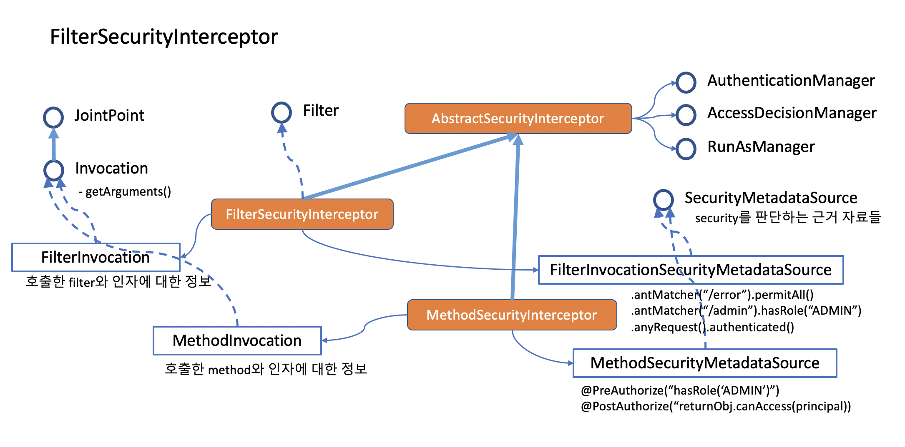

# 스프링 시큐리티의 권한

## AOP : Aspect Oriented Programming

스프링 전반을 아우르는 여러 철학이 있습니다. 가장 중요한 철학은 DI(의존성 주입) 이죠. 개발자가 직접 코딩하지 말고 컨테이너에게 맡기라는 말입니다. DI를 통해 약한 상관성(Loosely coupled)을 설계할 수 있고 모듈화를 완성할 수 있습니다. DI와 함께 매우 중요한 철학이 관심사의 분리입니다. 코드를 스파게티로 엮지 말고 관심이 있는 코드들을 따로 관리하라는 거죠. 관심사 분리가 가능한 이유는 AOP 기술 덕분입니다. AOP는 아래와 같은 개념들로 구성됩니다.

### AOP란

- Aspect : 공통의 관심사
  - 권한 처리
  - 로그
  - 트렌젝션 관리
  - 세션관리
  - 기타...
- Weaving
  - 빈과 빈을 Proxy 로 감싸서 연결해주는 작업
  - 빈과 빈의 호출사이에 PointCut을 적용해서 JoinPoint 를 판별한 다음 PointCut 을 요청한 Advice를 JoinPoint에 적용해줌.
- PointCut : JoinPoint 를 만들어 내는 칼
  - JoinPoint 를 지적해주는 Expression
  - annotation 마킹
- JoinPoint : 관절. 빈과 빈 사이에서 호출이 일어나는 곳
  - 메소드 호출
  - setter 를 통한 멤버 주입
  - 생성자 호출
- Advice : 호출시 추가로 처리해줄 로직
  - 인터셉트 해서 주입해줄 코드

## 권한 (Authorization)

- SecurityFilerChain 당 한개의 FilterSecurityInterceptor를 둘 수 있고, 각 SecurityInterceptor당 한개의 AccessDecisionManager 를 둘 수 있습니다. 반면 Method 권한 판정은 Global 한 권한 위원회를 둡니다. 그래서 GlobalMethodSecurityConfiguration 을 통해 AccessDecisionManager 를 설정합니다.
- 인증이 모든 요청에 대해 공통적으로 처리해야 하는 것인데 반해 권한은 상황상황에 맞게 처리해야 하는 특징이 있습니다.
- 그래서 인증을 처리하는 코드는 필터와 어울리고, 권한은 interceptor 와 어울려 동작합니다. 필터는 servlet container 가 제공하는 구조를 스프링이 자체 filterchain 을 만들어서 관리하는 방식으로 처리하고 있고, interceptor 는 스프링이 빈을 등록하고 프락시 객체를 가지고 엮어주는 과정에서 각 PointCut에 의해 구분된 JoinPoint에 interceptor 가 Advice 하는 메커니즘으로 작동합니다.
- 필터 위에 상주하는 Interceptor 를 FilterSecurityInterceptor라 하고 Method 위에 annotation의 형태로 상주하는 Interceptor 를 MethodSecurityInterceptor 라고 합니다. FilterInterceptor 는 필터 설정에서 설정하고 MethodInterceptor 는 annotation 으로 설정합니다. @EnableGlobalMethodSecurity 를 설정해줘야 MethodSecurityInterceptor 가 동작합니다.

## 권한 처리에 관여하는 것들

그런데 권한을 체크하려면 다음과 같은 고민을 해봐야 합니다.

- 접근하려고 하는 사람이 어떤 접근 권한을 가지고 있는가?

  - GrantedAuthority
    - Role Based
    - Scope Based
    - User Defined

- 접근하려고 하는 상황에서는 체크해야 할 내용은 무엇인가?

  - SecurityMetadataSource, ConfigAttribute
  - 정적인 경우와 동적인 경우
  - AccessDecisionVoter 가 vote 해줌

- 여러가지 판단 결과가 나왔을 때 취합은 어떤 방식으로 할 것인가?
  - AccessDecisionManager : 권한 위원회
    - AffirmativeBased : 긍정 위원회
    - ConsensusBased : 다수결 위원회
    - UnanimouseBased : 만장일치 위원회

## 인증과 권한의 구조

- 인증이 AuthenticationFilter 를 가지고 Authentication을 발급해주는 관계였다면, 권한은 SecurityInterceptor 에서 Access Granted 와 Denied 를 판정하는 결과를 만들어 내는 대응 관계를 가지고 있습니다.
- 인증이 제공해 주는 권한과 각 Interceptor가 위치한 포인트의 조건들(ConfigAttribute) 들을 가지고 판정을 내려주는 Voter 들에 따라 Granted / Denied 가 구분이 됩니다. 그렇지만 권한은 인증보다 훨씬 상황이 다양하다고 볼 수 있습니다.
- AccessDecisionManager 는 인터페이스입니다. 반드시 Voter 를 구현해서 처리해야 할 필요는 없습니다. 솔직히 Application을 구현한다면 Voter 없이 구현하는 것이 간단할 수 있습니다.

## 권한 처리 클래스

  
  
---

### 참고 자료

- https://www.baeldung.com/spring-security-custom-voter
