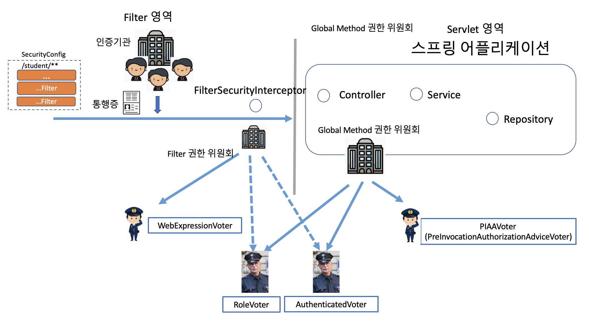
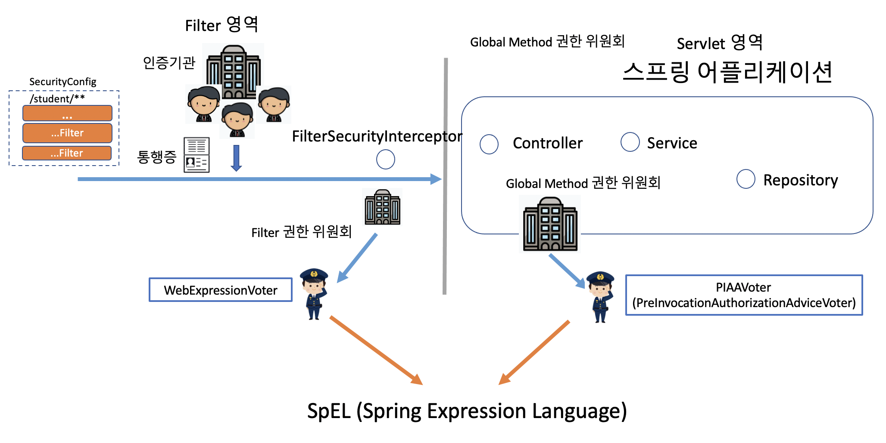
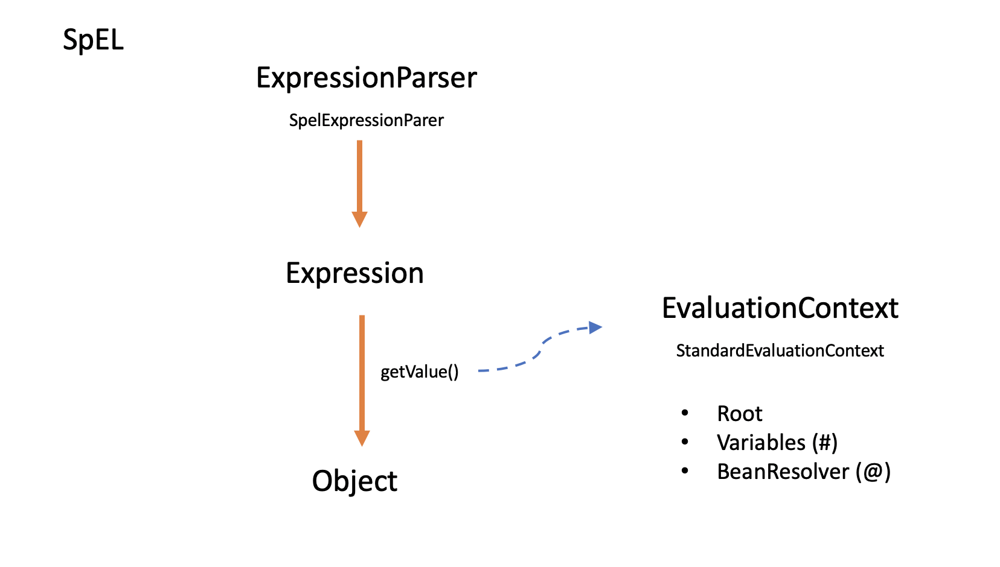
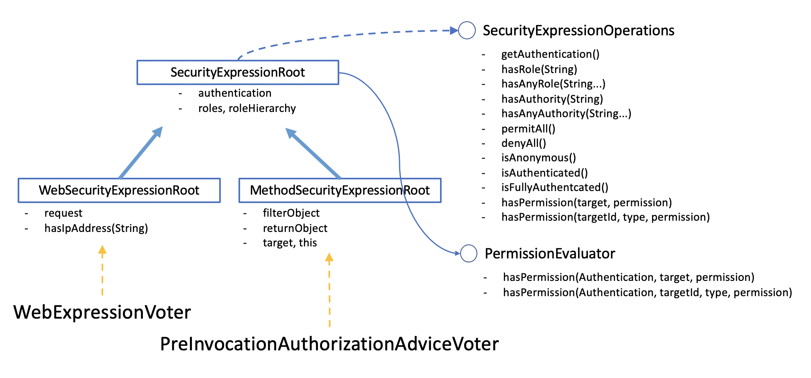
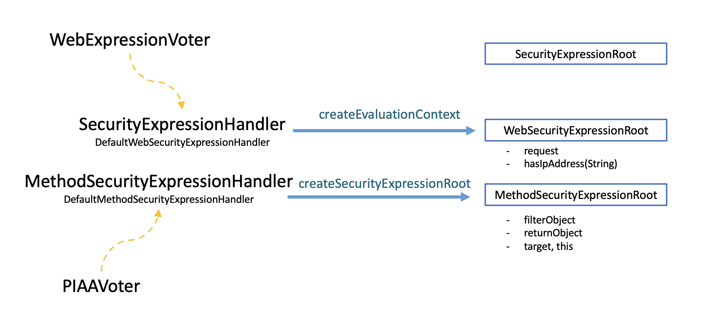

# 권한 처리

권한은 기본적으로 AccessDecisionManager 를 구현해서 처리할 수 있습니다. 하지만 기존에 잘 구현된 소스들을 사용하려면 Voter 기반의 AccessDecisionManager 를 사용하는 것이 좋습니다. 기존의 구현체는 아래의 세가지가 있습니다.

- AccessDecisionManager : 권한 위원회
  - AffirmativeBased : 긍정 위원회
  - ConsensusBased : 다수결 위원회
  - UnanimouseBased : 만장일치 위원회

각각의 기능은 각 클래스의 decide() 메소드를 보면 쉽게 확인할 수 있습니다.

Voter 기반의 AccessDecisionManager 를 이해하려면 각 Voter 들이 어떻게 동작하는지 알고 있는 것이 좋습니다.

## 권한 심사에 참여하는 Voter 들

## @Secured 어노테이션 기반 Voter

### RoleVoter

Role 기반의 권한은 리눅스부터 아파치, 톰켓등 IT 초기부터 전통적으로 구현해서 사용하던 가장 직관적인 권한 체계입니다. 하지만, Role 을 기반으로 권한을 판단하기엔, 상황이 너무 다양해졌죠. 그래서 Role 을 확장한 Authority 기반의 권한 체계를 사용하고 있습니다. 그렇지만, 기존의 Role 기반이 가지고 있는 직관적이고 계층적인 사용성을 그대로 사용할 수 있도록 해주기 위해 RoleVoter가 쓰입니다.

- @Secured("ROLE_USER")
- ROLE_xxx : GrantedAuthority
- 권한 계층 선언 : RoleHierarchyVoter

### AuthenticatedVoter

인증(통행증)을 받았다면 그 인증의 종류가 어떤 종류인지를 판단합니다. 이제 막 인증을 받고 들어온 사용자와 RememberMe 토큰을 통해서 들어온 사용자와 익명 사용자를 구분하기 위해 쓰입니다. RememberMe 인증 사용자는 탈취된 토큰을 가지고 들어온 사용자일 수 있기 때문에 필요한 경우 한번 더 인증을 요구할 수 있습니다.

- authenticated
  - fully authenticated
  - remember me
- anonymous

## SpEL을 사용하는 Voter

하지만 RoleVoter 는 SpEL을 사용하는 WebExpressionVoter 나 PIAAVoter (PreInvocationAuthorizationAdviceVoter)
가 사용성을 대체하고 있습니다.

- SpEL(Spring Expression Language)은 스프링3 에서 부터 사용하기 시작해 그 실용성이 입증되기 시작합니다.
- 스프링 Security 에서도 이 SpEL을 사용해 권한 검증을 하나의 Voter로 통일하기 시작합니다. 그래서 결국 의미있게 남은 Voter 는 WebExpressionVoter와 PIAAVoter 밖에 남지 않았다고 볼 수 있습니다.

### SpEL

Spring Expression Language 는 표현식을 통해 객체의 값을 가져오거나 동작을 시켜주는 기능을 합니다.사실상 컴파일언어라고 할 수 있는 자바를 스크립트언어처럼 동작하게 해주는 기능입니다.

## SecurityExpressionRoot

- permitAll, denyAll
- hasRole, hasAnyRole, hasAuthority, hasAnyAuthority : RoleVoter의 기능을 대신해 줍니다. 이전에는 Role을 쓰더라도 ROLE*를 사용해서 권한을 판정해야 했기 때문에 ROLE*를 앞에 붙여줘야 하는지, 말아야 하는지 햇갈리는 경우가 많았습니다. 이제는 method 에서 Role 로 판단을 할지 Authority로 판단을 할지 명확하게 구분해 줍니다.
- isAnonymous, isAuthenticated, isFullyAuthenticated : AuthenticatedVoter 의 기능을 대체합니다.
- hasPermission
  - target : 대상 객체를 보고 permission을 검사합니다.
  - targetId, type : type을 보고 targetId인 대상 객체를 조회해와서 permission을 검사합니다.

## PermissionEvaluator

이제까지의 권한 검사는 Authentication 통행증을 검사하는 것이었습니다. 그런데, 심사를 하려면 통행증만 검사하면 안되고, 가져가려는 물건이 무엇인지를 같이 봐야 하는 경우가 많습니다.

가령 기말 고사 시험지를 작성중이라고 해 봅시다.

- 시험지를 작성하는 선생님은 시험지를 볼 수 있음.
- 교장 선생님은 모든 시험지를 사전에 볼 수 있음.
- 교과 선생님들 중에 허락된 선생님은 시험지를 볼 수 있음.
- 그 밖의 선생님과 학생은 시험지를 볼 수 없음.

이런 경우라면 당연히 어떤 시험지인지, 그리고 그 시험지에 대한 열람 권한이 누구에게 있는지... 여러가지 데이터들이 모여야 해당 권한을 판단할 수가 있습니다. 이런 경우에는 PermissionEvaluator 를 사용하거나 객체 별로 접근 권한을 DB로 관리해주는 ACL 처럼 권한을 체크하기 위한 별도의 설계가 들어가야 합니다.

## WebExpressionVoter와 PIIAVoter (@PreAuthorize 어노테이션 기반)

WebExpressionVoter와 PIIAVoter 는 모두 아래와 같은 방식으로 SpEL 을 사용합니다.

## 참고 자료

- https://www.baeldung.com/spring-security-create-new-custom-security-expression
