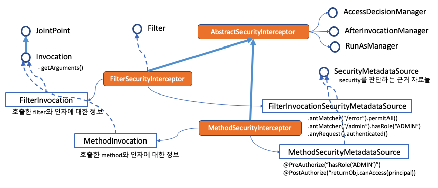
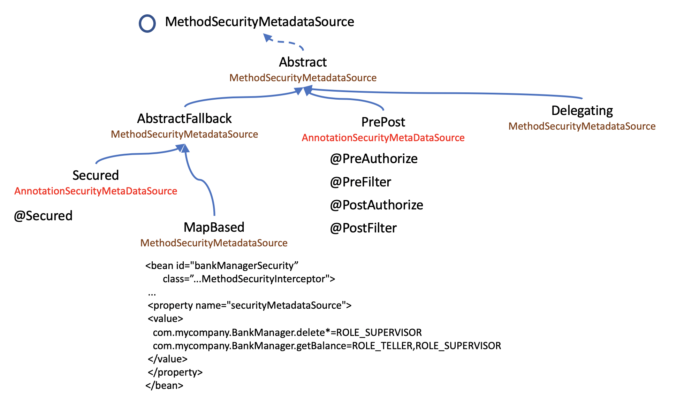

# MethodSecurityMetadataSource

Expression 기반의 권한 체크가 편리하고 권장되기는 하지만,
기존에 구축된 Security 들 중에 일부는 @Secured 기반으로 구축이 되어
있을 수 있고, 그 기반에서 소스를 유지보수 혹은 확장해 나가야 할 수도 있습니다.

@Secured 기반의 권한 체크는 메소드의 사전에만 체크를 하기 때문에
사후 체크를 하려면 @PostAuthorize(혹은 @PostFilter) 를 사용하거나
별도의 AOP 를 설계 해야 합니다.
@Secured 는 또한 Voter 를 추가할 수 있도록 설계되었습니다.
때문에 Voter 기반의 AccessDecisionManager 와 잘 어울리기는 합니다.

  

메소드의 권한 체크는 MethodSecurityInterceptor 를 통해
intercept된 메소드의 전후로 체크가 이루어집니다.



## GlobalMethodSecurityConfiguration

메소드 권한을 설정하는 GlobalMethodSecurityConfiguration 에서 methodSecurityMetadataSource() 를 만들어 내는 곳에서 어노테이션을 파싱해 MethodSecurityMetadataSource 를 만들어 낸다.

```java
public MethodSecurityMetadataSource methodSecurityMetadataSource() {
  List<MethodSecurityMetadataSource> sources = new ArrayList<>();
  ExpressionBasedAnnotationAttributeFactory attributeFactory = new ExpressionBasedAnnotationAttributeFactory(
      getExpressionHandler());
  MethodSecurityMetadataSource customMethodSecurityMetadataSource = customMethodSecurityMetadataSource();
  if (customMethodSecurityMetadataSource != null) {
    sources.add(customMethodSecurityMetadataSource);
  }
  boolean hasCustom = customMethodSecurityMetadataSource != null;
  boolean isPrePostEnabled = prePostEnabled();
  boolean isSecuredEnabled = securedEnabled();
  boolean isJsr250Enabled = jsr250Enabled();

  if (isPrePostEnabled) {
    sources.add(new PrePostAnnotationSecurityMetadataSource(attributeFactory));
  }

  if (isSecuredEnabled) {
    sources.add(new SecuredAnnotationSecurityMetadataSource());
  }

  if (isJsr250Enabled) {
    ...
  }
  return new DelegatingMethodSecurityMetadataSource(sources);
}
```

## Method Security Meta Annotations

코드의 가독성을 향상시키기 위해 meta annotation을 쓸수도 있습니다. 반복되는 복잡한 표현식이 있다면 특별히 유용합니다.

예를들어 아래와 같은 권한 체크가 빈번하다면

@PreAuthorize("#contact.name == authentication.name")

```java
@Retention(RetentionPolicy.RUNTIME)
@PreAuthorize("#contact.name == authentication.name")
public @interface ContactPermission {}
```

위와같이 annotation을 추가해서 재활용할 수 있습니다.
