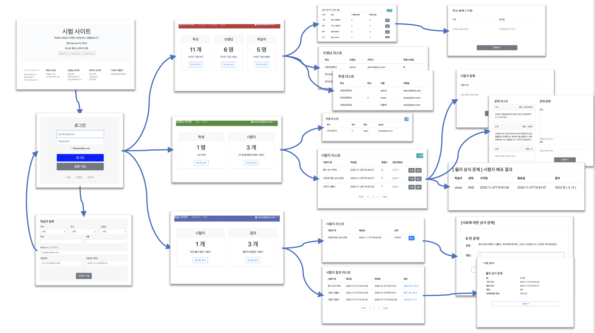

# 시험 사이트

- 학생, 선생님, 관리자가 각기 다른 테이블에 관리된다.
- 로그인 하는 페이지가 별도로 있다.
- 페이지를 한 서버에 만들 수도 있고, 별도의 서버로 나눌 수도 있다.

## 개발환경 세팅

- IntelliJ 에서 compiler.automake.allow.when.app.running 을 체크하고
- 설정의 Build project automatically 를 체크하고
- Run configuration 에서 On 'Update' action 과 On frame deactivation 의 값을 적절하게 수정해 줍니다.
- application.yml 에서 devtool 의 livereload 기능을 켜줍니다.

## thymeleaf

- 기본 문법
- 템플릿 이용하는 방법
- layout 설정하기

## 사이트 맵

- 메인 화면
- 로그인 화면
- 가입 화면
- 관리자 메인
  - 학교 리스트
    - 학교 등록
  - 선생님 리스트
  - 학생 리스트
- 선생님 메인
  - 학생 리스트
  - 시험지 리스트
    - 시험지 생성
    - 시험지 수정
    - 시험 결과 보기
- 학생 메인
  - 응시할 시험지 리스트
    - 시험 보기
  - 결과 시험지 리스트
    - 시험 결과

참고 사이트

- https://velog.io/@bread_dd/Spring-Boot-Devtools
- http://progtrend.blogspot.com/2019/05/thymeleaf.html
