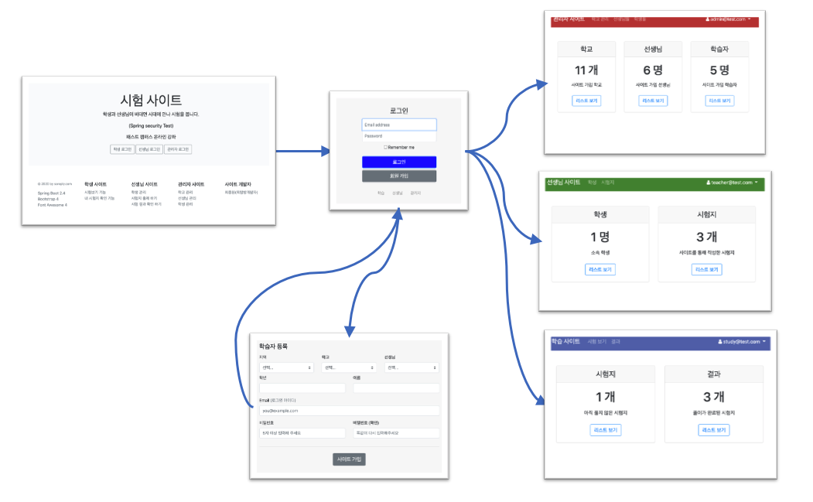

# 화면 작업

## Thymeleaf 에 대한 개발 환경 설정

- 서버를 만듭니다.
- application.yml 을 설정합니다.
- 기본 css와 js 파일을 가져옵니다.
- thymeleaf 에 대한 기본 기능을 테스트 합니다.

## 메인 화면 가져오기



메인 화면 html 을 아래와 같이 가져옵니다.

```html
<!DOCTYPE html>
<html lang="ko">
  <head>
    <meta charset="utf-8" />
    <meta
      name="viewport"
      content="width=device-width, initial-scale=1, shrink-to-fit=no"
    />
    <meta name="description" content="" />
    <meta
      name="author"
      content="Mark Otto, Jacob Thornton, and Bootstrap contributors"
    />
    <meta name="generator" content="Jekyll v4.1.1" />
    <title>패스트 캠퍼스 - 스프링 시큐리티 - 테스트 사이트</title>
    <link th:href="@{/css/bootstrap.css}" rel="stylesheet" />

    <style>
      .bd-placeholder-img {
        font-size: 1.125rem;
        text-anchor: middle;
        -webkit-user-select: none;
        -moz-user-select: none;
        -ms-user-select: none;
        user-select: none;
      }

      @media (min-width: 768px) {
        .bd-placeholder-img-lg {
          font-size: 3.5rem;
        }
      }
    </style>
    <link th:href="@{/css/intro.css}" rel="stylesheet" />
  </head>
  <body>
    <div
      class="position-relative overflow-hidden p-3 p-md-5 m-md-3 text-center bg-light"
    >
      <div class="col-md-7 p-lg-7 mx-auto my-7">
        <h1 class="display-4 font-weight-normal">시험 사이트</h1>
        <p class="lead font-weight-normal">
          학생과 선생님이 비대면 시대에 만나 시험을 봅니다.
        </p>
        <p class="lead font-weight-normal">(Spring security Test)</p>
        <p class="lead font-weight-normal">패스트 캠퍼스 온라인 강좌</p>
        <a class="btn btn-outline-secondary" href="/login?site=study">
          학생 로그인
        </a>
        <a class="btn btn-outline-secondary" href="/login?site=teacher">
          선생님 로그인
        </a>
        <a class="btn btn-outline-secondary" href="/login?site=manager">
          관리자 로그인
        </a>
      </div>
    </div>

    <footer class="container py-5">
      <div class="row">
        <div class="col-12 col-md">
          <small class="d-block mb-3 text-muted"
            >&copy; 2020 by soreply.com</small
          >
          <ul class="list-unstyled text-small">
            <li><a class="text-muted" href="#"> Spring Boot 2.4 </a></li>
            <li><a class="text-muted" href="#"> Bootstrap 4 </a></li>
            <li><a class="text-muted" href="#"> Font Awesome 4 </a></li>
          </ul>
        </div>
        <div class="col-6 col-md">
          <h5>학생 사이트</h5>
          <ul class="list-unstyled text-small">
            <li><a class="text-muted" href="#"> 시험보기 기능 </a></li>
            <li><a class="text-muted" href="#"> 내 시험지 확인 기능 </a></li>
          </ul>
        </div>
        <div class="col-6 col-md">
          <h5>선생님 사이트</h5>
          <ul class="list-unstyled text-small">
            <li><a class="text-muted" href="#"> 학생 관리 </a></li>
            <li><a class="text-muted" href="#"> 시험지 출제 하기 </a></li>
            <li><a class="text-muted" href="#"> 시험 결과 확인 하기 </a></li>
          </ul>
        </div>
        <div class="col-6 col-md">
          <h5>관리자 사이트</h5>
          <ul class="list-unstyled text-small">
            <li><a class="text-muted" href="#">학교 관리 </a></li>
            <li><a class="text-muted" href="#">선생님 관리 </a></li>
            <li><a class="text-muted" href="#">학생 관리 </a></li>
          </ul>
        </div>
        <div class="col-6 col-md">
          <h5>사이트 개발자</h5>
          <ul class="list-unstyled text-small">
            <li><a class="text-muted" href="#">최종원(옥탑방개발자)</a></li>
          </ul>
        </div>
      </div>
    </footer>
    <script src="https://code.jquery.com/jquery-3.5.1.min.js"></script>
    <script src="/js/bootstrap.bundle.min.js"></script>
  </body>
</html>
```

## 로그인 화면 가져오기

```html
<!DOCTYPE html>
<html lang="ko" xmlns:th="http://www.thymeleaf.org">

<meta charset="utf-8">
<meta name="viewport" content="width=device-width, initial-scale=1, shrink-to-fit=no">
<meta name="description" content="">
<title> 로그인 </title>
<link href="/css/bootstrap.css" rel="stylesheet">

<style>
  .bd-placeholder-img {
    font-size: 1.125rem;
    text-anchor: middle;
    -webkit-user-select: none;
    -moz-user-select: none;
    -ms-user-select: none;
    user-select: none;
  }

  @media (min-width: 768px) {
    .bd-placeholder-img-lg {
      font-size: 3.5rem;
    }
  }
</style>
<link href="/css/login.css" rel="stylesheet">
</head>
<body class="text-center">

<div class="login-content">
    <form class="form-signin" method="post" th:action="@{/login}">
      <h1 class="h3 mb-3 font-weight-normal"> 로그인 </h1>
      <label for="username" class="sr-only">Email address</label>
<!--      <input type="email" -->
<!--             id="username" name="username" class="form-control" placeholder="Email address" required autofocus>-->
      <input type="text"
             id="username" name="username" class="form-control" placeholder="Email address" autofocus>
      <label for="password" class="sr-only">Password</label>
      <input type="password" id="password" name="password"  class="form-control" placeholder="Password">
      <div class="checkbox mb-3">
        <label>
          <input type="checkbox" name="remember-me"> Remember me
        </label>
      </div>
      <input type="hidden" name="site" th:value="${site}" />
      <input type="hidden" name="redirectUrl" th:value="${'/'+site}" />
      <button class="btn btn-lg btn-primary btn-block" th:classappend="${site}" type="submit"> 로그인 </button>
      <a th:if="${!site.equals('manager')} " class="btn btn-lg btn-secondary btn-block" th:href="@{/signup(site=${site})}"> 회원 가입 </a>

      <div class="link-site">
        <ul>
          <li><a href="/login?site=study"> 학습 </a></li>
          <li><a href="/login?site=teacher"> 선생님</a> </li>
          <li><a href="/login?site=manager"> 관리자</a> </li>
        </ul>
      </div>
  </form>


  <div th:if="${error}" class="alert alert-danger alert-dismissible fade show id-password-alert" role="alert">
    <strong>아이디(email)</strong> 혹은 <strong>패스워드</strong> 가 올바르지 않습니다.
    <button type="button" class="close" data-dismiss="alert" aria-label="Close">
      <span aria-hidden="true">&times;</span>
    </button>
  </div>

  <script>
    $(document).ready(()=>{
      const alert = $('.alert');
      if(alert){
        setTimeout(()=>$(alert).hide(), 5000);
      }
    })
  </script>
  <style>
    .id-password-alert {
      width: 500px;
      margin: auto;
    }
  </style>
</div>
<script src="https://code.jquery.com/jquery-3.5.1.min.js"></script>
<script src="/js/bootstrap.bundle.min.js"></script>
</body>
</html>

```
