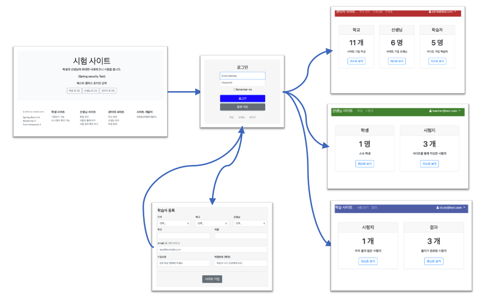

# 사이트 작업



## 관리자 사이트

관리자 사이트의 메인 화면을 만듭니다.
먼저 공통 파일을 등록하고

- head.html

```html
<!DOCTYPE html>
<html
  lang="ko"
  xmlns:th="http://www.thymeleaf.org"
  xmlns:layout="http://www.ultraq.net.nz/thymeleaf/layout"
>
  <head th:fragment="headFragment">
    <meta charset="utf-8" />
    <meta
      name="viewport"
      content="width=device-width, initial-scale=1, shrink-to-fit=no"
    />
    <meta name="description" content="" />
    <meta
      name="author"
      content="Mark Otto, Jacob Thornton, and Bootstrap contributors"
    />
    <meta name="generator" content="Jekyll v4.1.1" />
    <title>사이트 예제</title>
    <link
      rel="stylesheet"
      href="https://cdnjs.cloudflare.com/ajax/libs/font-awesome/4.7.0/css/font-awesome.min.css"
    />
    <link href="/css/bootstrap.css" rel="stylesheet" />
    <link href="/css/index.css" rel="stylesheet" />
  </head>
</html>
```

- footer.html

```html
<!DOCTYPE html>
<html lang="ko" xmlns:th="http://www.thymeleaf.org">
  <footer th:fragment="footerFragment">
    <div class="py-12 footer">
      <div class="row">
        <div class="col-12 col-md" style="margin-right: 1em;">
          <small class="d-block mb-3 text-muted"
            >Copyright &copy; 2020 by soreply.com
          </small>
        </div>
      </div>
      <script src="https://code.jquery.com/jquery-3.5.1.min.js"></script>
      <script src="/js/bootstrap.bundle.min.js"></script>
    </div>
  </footer>
</html>
```

- 관리자 화면의 index.html 파일과 layout, menu 파일을 만듭니다.
- index.html

```html
<!DOCTYPE html>
<html
  xmlns:th="http://www.thymeleaf.org"
  xmlns:layout="http://www.ultraq.net.nz/thymeleaf/layout"
  layout:decorator="/manager/layout.html"
>
  <head>
    <title>관리자</title>
  </head>

  <div layout:fragment="content">
    <div class="container">
      <div class="card-deck mb-3 text-center" style="margin-top: 3em;">
        <div class="card mb-4 shadow-sm">
          <div class="card-header">
            <h4 class="my-0 font-weight-normal">학교</h4>
          </div>
          <div class="card-body">
            <h1 class="card-title pricing-card-title">
              <span th:text="${schoolCount}">0</span> 개
            </h1>
            <ul class="list-unstyled mt-3 mb-4">
              <li>사이트 가입 학교</li>
            </ul>
            <a
              type="button"
              class="btn btn-md btn-outline-primary"
              href="/mng/school/list"
            >
              리스트 보기
            </a>
          </div>
        </div>
        <div class="card mb-4 shadow-sm">
          <div class="card-header">
            <h4 class="my-0 font-weight-normal">선생님</h4>
          </div>
          <div class="card-body">
            <h1 class="card-title pricing-card-title">
              <span th:text="${teacherCount}">0</span> 명
            </h1>
            <ul class="list-unstyled mt-3 mb-4">
              <li>사이트 가입 선생님</li>
            </ul>
            <a
              type="button"
              class="btn btn-md btn-outline-primary"
              href="/mng/teacher/list"
            >
              리스트 보기
            </a>
          </div>
        </div>
        <div class="card mb-4 shadow-sm">
          <div class="card-header">
            <h4 class="my-0 font-weight-normal">학습자</h4>
          </div>
          <div class="card-body">
            <h1 class="card-title pricing-card-title">
              <span th:text="${studyCount}">0</span> 명
            </h1>
            <ul class="list-unstyled mt-3 mb-4">
              <li>사이트 가입 학습자</li>
            </ul>
            <a
              type="button"
              class="btn btn-md btn-outline-primary"
              href="/mng/study/list"
            >
              리스트 보기
            </a>
          </div>
        </div>
      </div>
    </div>
  </div>
</html>
```

- layout.html

```html
<!DOCTYPE html>
<html
  lang="ko"
  xmlns:th="http://www.thymeleaf.org"
  xmlns:layout="http://www.ultraq.net.nz/thymeleaf/layout"
>
  <head th:replace="/head :: headFragment">
    <title layout:title-pattern="$LAYOUT_TITLE - $CONTENT_TITLE">default</title>
  </head>
  <body>
    <header th:replace="/manager/menu :: headerFragment"></header>
    <div class="container">
      <div layout:fragment="content"></div>
      <footer th:replace="/footer :: footerFragment"></footer>
    </div>
  </body>
</html>
```

- menu.html

```html
<!DOCTYPE html>
<html lang="ko" xmlns:th="http://www.thymeleaf.org">
  <header th:fragment="headerFragment">
    <nav class="navbar navbar-expand-sm navbar-dark bg-dark site-manager">
      <div class="container">
        <a class="navbar-brand" href="/manager"> 관리자 사이트 </a>
        <button
          class="navbar-toggler"
          type="button"
          data-toggle="collapse"
          data-target="#navbarsExample03"
          aria-controls="navbarsExample03"
          aria-expanded="false"
          aria-label="Toggle navigation"
        >
          <span class="navbar-toggler-icon"></span>
        </button>

        <div class="collapse navbar-collapse" id="navbarsExample03">
          <ul class="navbar-nav mr-auto">
            <li
              class="nav-item"
              th:classappend="${menu=='school' ? 'active' : ''}"
            >
              <a class="nav-link" href="/manager/school/list"> 학교 관리 </a>
            </li>
            <li
              class="nav-item"
              th:classappend="${menu=='teacher' ? 'active' : ''}"
            >
              <a class="nav-link" href="/manager/teacher/list"> 선생님들 </a>
            </li>
            <li
              class="nav-item"
              th:classappend="${menu=='study' ? 'active' : ''}"
            >
              <a class="nav-link" href="/manager/study/list"> 학생들 </a>
            </li>
          </ul>
          <ul class="navbar-nav right-menus">
            <li class="nav-item dropdown" sec:authorize="isAuthenticated()">
              <a
                class="nav-link dropdown-toggle active"
                href="#"
                id="user-menus"
                data-toggle="dropdown"
                aria-haspopup="false"
                aria-expanded="false"
              >
                <i class="fa fa-user"></i>
                <span sec:authentication="name"> jongwon </span>
              </a>
              <div class="dropdown-menu" aria-labelledby="user-menus">
                <a class="dropdown-item" href="#"> 내 정보 </a>
                <a class="dropdown-item" href="/logout"> 로그 아웃 </a>
              </div>
            </li>
          </ul>
        </div>
      </div>
    </nav>
  </header>
</html>
```

## 학생, 선생님 사이트

같은 방법으로 학생과 선생님 사이트를 만듭니다.
