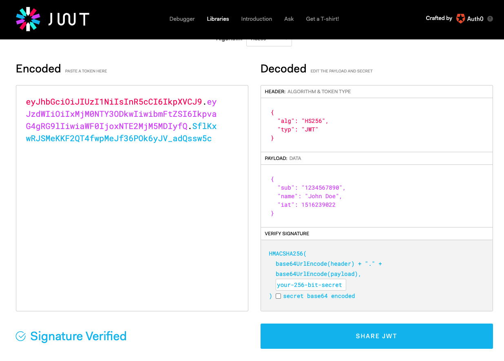
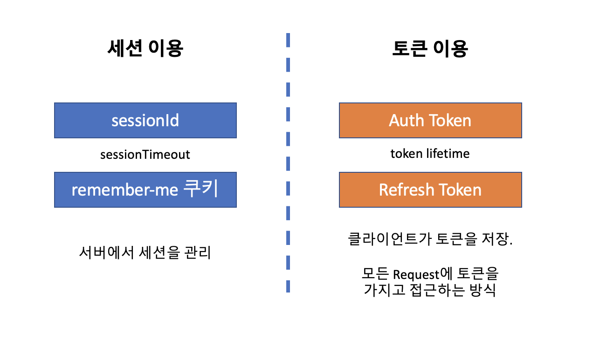

# JWT 토큰이란?

서버에서 인증된 사용자가 인증을 유지해주는 방법으로 보통은 세션을 사용합니다. 서버 세션을 사용하면 인증된 사용자는 매우 편리하게 서비스를 이용할 수 있고, 대부분의 웹애플리케이션 서버가 세션을 지원하기 때문에 편리합니다. 하지만,

- 서버를 여러대 둘 경우 (scale out),
- 같은 사용자가 서로 다른 도메인의 데이터를 요청할 경우, (SSO)
  에는 세션을 유지하기 위한 비용이 매우 커지게 됩니다.

이 때는 서버에 사용자 정보를 저장하는 대신 클라이언트에 사용자 정보를 내려주고,
서버는 토큰의 사용자 정보를 모든 요청에서 확인하고 서비스를 해주는 방식(sessionless)일 때,
JWT 토큰이 유용하게 사용됩니다.

JWT 자바 라이브러리는 보통 auth0.com 에서 만든 java-jwt 라이브러리를 쓰거나,
okta 에서 만든 jjwt 라이브러리를 사용합니다.

- JWT 토큰 확인 : https://jwt.io/#debugger-io
- JWT : RFC7519 https://datatracker.ietf.org/doc/html/rfc7519
- JWS : RFC7515 https://datatracker.ietf.org/doc/html/rfc7515
- JWE : RFC7516 https://datatracker.ietf.org/doc/html/rfc7516

## jwt.io 사이트

- JWT 토큰의 구조 : header + body + signature
- 구현 라이브러리
  - java-jwt : oauth0.io
  - jjwt : okta

## JWT 스펙에서 지정한 claim

- iss : Issuer 토큰을 발행한 사람(단체,사이트)이 누구인지
- sub : Subject 무엇에 관한 토큰인지
- aud : Audience 누구를 대상으로 한 토큰인지
- exp : Expiration 토큰의 만료 시간은 언제인지
- nbf : Not Before 토큰이 언제부터 유효한지
- iat : Issued At 토큰 발행 시간
- jti : JWT ID : 토큰 자체의 아이디(일련번호?)
- 그 밖에 인증에 필요하거나 대상서버에서 필요로 하는 데이터

### 토큰에는 어떤 내용을 넣어야 할까?

- 일반적으로는 인증에 필요한 최소한의 데이터를 넣슶니다.
- 비밀번호나 전화번호등을 넣는 것은 안전하지 않습니다.
- 이 토큰은 언제든 공개할 수 있는 정보를 넣는 것이 좋습니다.
- 왜냐하면 서버에서 인증된 키가 아니라도 언제든 서버는 이 토큰을 열어서 그 안에 어떤 Claim 이 있는지를 볼 수 있습니다.

## 토큰을 어떻게 관리할 것인가?

- 이론적으로는 토큰을 클라이언트가 관리하게 합니다.
- 하지만, 실제로 서버는 사용자 정보 캐싱이나 토큰의 유효성 평가, 혹은 refresh 토큰 정책을 위해 서버에 토큰을 관리하기도 합니다.
- 이 경우, 토큰과 사용자 정보를 관리하는 방법으로 다음과 같은 방법들을 사용하기도 합니다.
  - redis, hazelcast
  - db 저장

## 간단한 SSO 사이트 구현할 때

인증 서버를 두고, 해당 인증서버로부터 토큰의 유효성을 검증하다록 하는 방식이 이상적이지만, 토큰을 다루는 방식이 동일하다면, 한 서버에서 발행한 토큰으로 SSO와 같은 효과를 볼 수도 있습니다.

- 인증 서버와 리소스 서버를 분리한다.
- 인증토큰을 여러 리소스 서버에 재사용한다.

참고자료

- https://www.gartner.com/reviews/market/access-management
