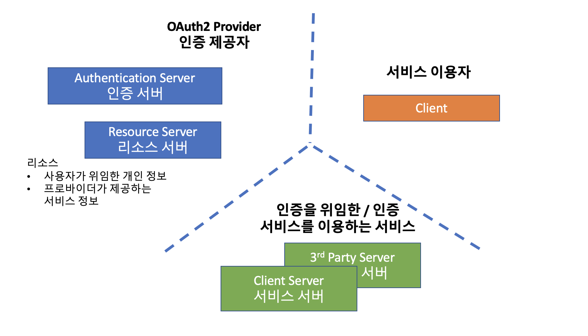

# OAuth2

스프링은 OAuth2 에 대해 많은 기본 기능들을 제공합니다.

## CommonOAuth2Provider

아래 4개의 Provider 에 대해 기본 정보들을 제공합니다.

- GOOGLE : https://console.cloud.google.com/
- GITHUB : https://github.com/settings/applications/new
- FACEBOOK : https://developers.facebook.com/
- OKTA

## 추가 가능한 OAuth2Provider ...

- naver : https://developers.naver.com/
- kakao : https://developers.kakao.com/

## OAuth2User

- facebook, naver, kakao
- OAuth2User : UserDetails 를 대체합니다.
- OAuth2UserService : UserDetailsService 를 대체합니다. 기본 구현체는 DefaultOAuth2UserService 입니다.

## OidcUser

- google
- OidcUser
- OidcUserService : OAuth2UserService 를 확장한 서비스
